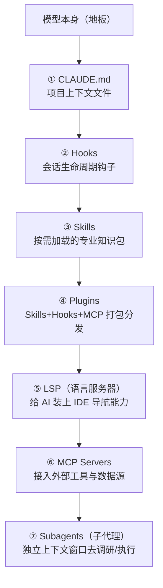
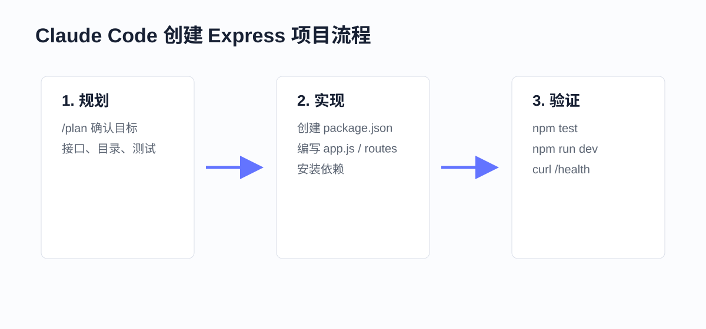
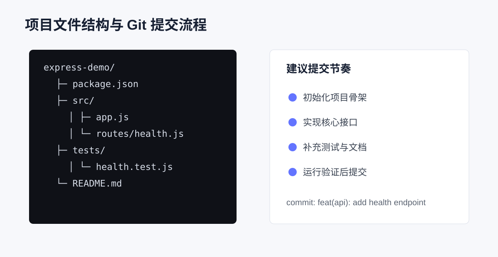
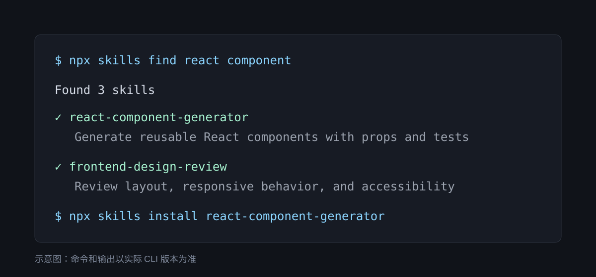

# 1. 概念

## 1-1 Vibe Coding: 感觉驱动的编程新范式
- 意图优先
- 快速迭代
- 信任但验证
- 上下文经营
## 1-2 为什么纯Vibe Coding在大项目中不够用
- 代码质量不可控
- 前后矛盾
- 缺乏全局视角
- 难以协作
## 1-3 核心概念
| 概念 | 一句话解释 |
|------|-----------|
| AI辅助编程 | 用自然语言指挥AI写代码，人类从"写代码"变成"指挥AI写代码" |
| Vibe Coding | 跟着感觉走的编程方式，适合快速原型和小项目 |
| Agentic Engineering | 系统化的AI驱动开发方法，适合大型项目 |
| Agent（智能体） | 能自主规划、执行、验证任务的AI系统 |
| SDD（规范驱动开发） | 先写规范（PRD/SPEC），再让AI按规范执行 |
| PRD | 产品需求文档，描述"做什么" |
| SPEC | 技术规范文档，描述"怎么做" |

# 2. Claude Code
## 2-1 “脚手架”比“模型”更重要：Harness 体系

官方反复强调一个观点：**决定 Claude Code 表现的，不只是背后的模型，还有围绕模型搭建的“脚手架 Harness”。**

>  **理解方式**：模型能力决定下限，项目上下文、工具权限、规则文件和工作流决定上限。实际生产中，围绕模型搭建的工具生态会显著影响最终表现。

本教程把 Claude Code 的工程化能力抽象成 **7 个扩展点**，建议按“从底到顶”的顺序理解——先打好上下文和规则基础，再接入更复杂的外部工具：


*图：Harness 的 7 层扩展点——下三层是“纪律”（项目上下文、钩子、知识），上四层是“武器”（包分发、IDE、外部、子代理）*

| 层 | 组件 | 作用 | 加载时机 |
|----|------|------|---------|
| ① | **CLAUDE.md** | 项目上下文文件（项目背景、约定、禁区） | 每次会话自动加载 |
| ② | **Hooks** | 会话生命周期钩子（启动/结束/文件写入等事件） | 事件触发 |
| ③ | **Skills** | 可复用的任务方法论（如“代码审查”“部署”） | 按需加载 |
| ④ | **Plugins** | 打包一整套 Skills + Hooks + MCP 配置 | 装上后始终生效 |
| ⑤ | **LSP**（语言服务器） | 给 AI 装上“跳到定义/查找引用”等 IDE 级导航 | 始终生效 |
| ⑥ | **MCP 服务器** | 打通 Claude 与外部工具（数据库、文档、票务系统） | 始终生效 |
| ⑦ | **Subagents**（子代理） | 独立上下文窗口的 Claude 实例，只返回结论 | 任务发出时创建 |

> 注意： **顺序重要！** 初学者不要在基础还没搭好时就急着上 MCP 或 Subagents。先把 CLAUDE.md、Hooks、Skills 这三层基本功做扎实再说。

---

## 2-2 安装

**npm安装**
```bash
npm install -g @anthropic-ai/claude-code
```

**验证安装：**

```bash
$ claude --version
```
## 2-3 cc-switch安装
**cc-switch** 是社区开源的一款桌面小工具，可以让你在多个 Claude Code 配置间一键切换。

- **项目地址**：https://github.com/farion1231/cc-switch
- **下载**：进入 Releases 页面，选对应系统（Windows、macOS、Linux）的安装包
- **使用**：打开 cc-switch → 点击“新增” → 填入 API Key 和 BaseURL → 起个名字（如 “Anthropic-官方”、“DeepSeek”、“GLM-CodingPlan”）保存 → 需要哪个点哪个

## 2-4 模型选择与切换

**方法一：启动时指定（临时使用）**

```bash
# 使用模型别名（推荐，自动指向最新版本）
$ claude --model opus      # 最强推理
$ claude --model sonnet    # 日常编码（默认）
$ claude --model haiku     # 快速轻量

# 使用具体模型名时，请以当前服务商官方文档为准
$ claude --model opus
$ claude --model "deepseek-v4-pro[1m]"
```

**方法二：运行中切换（使用斜杠命令）**

在 Claude Code 对话中直接输入：

```
> /model           # 打开模型选择器（交互式）
> /model sonnet      # 直接切换到 Sonnet
> /model opus       # 直接切换到 Opus
```

## 2-5 核心配置详解
Claude Code 有多层配置体系，从全局到项目级，层层覆盖。

**配置层级：**

```
全局配置（影响所有项目）
  └── ~/.claude/settings.json

项目级配置（只影响当前项目）
  └── 项目根目录/.claude/settings.json

项目上下文文件（告诉AI项目背景信息）
  └── 项目根目录/CLAUDE.md ← 最重要！
```

### 2-5-1 settings.json 配置文件
Claude Code 的配置文件位于 `~/.claude/settings.json`（全局）或项目目录下的 `.claude/settings.json`（项目级）。

常用配置项：

```json
{
  // 允许 Claude Code 执行的操作（不再需要每次确认）
  "permissions": {
   "allow": [
     "Read",        // 读取文件
     "Write",       // 写入文件
     "Bash(npm *)",   // 执行 npm 命令
     "Bash(git *)",   // 执行 git 命令
     "Bash(node *)"   // 执行 node 命令
   ],
   "deny": [
     "Bash(rm -rf *)" // 禁止执行危险的删除命令
   ]
  },
  // 默认使用的模型
  "model": "sonnet",
  // 自动紧凑阈值（上下文使用超过此比例时自动压缩）
  "autoCompactThreshold": 80
}
```
> **注意**：权限设置要谨慎。过于宽松的权限可能导致AI执行你不期望的操作。建议初学者保持默认设置，让 Claude Code 在执行每个操作前都询问你确认。


### 2-5-2 CLAUDE.md：你的项目"说明书"
CLAUDE.md 是 Claude Code 中**最重要的配置文件之一**。有了 CLAUDE.md，它一启动就知道项目的全部背景，效率大幅提升。

**CLAUDE.md 模板（可直接复制修改）：**

````markdown
  # 项目名称

  ## 项目概述
  一句话描述这个项目做什么。

  ## 技术栈
  - 前端：Next.js 14 + TypeScript + Tailwind CSS
  - 后端：Next.js API Routes
  - 数据库：Prisma + SQLite
  - 部署：Vercel

  ## 项目结构
  ​```
  src/
  ├── app/         # Next.js App Router 页面
  │   ├── api/      # API 路由
  │   ├── layout.tsx # 全局布局
  │   └── page.tsx   # 首页
  ├── components/   # React 组件
  │   ├── ui/      # 通用UI组件
  │   └── features/  # 业务组件
  ├── lib/         # 工具函数和配置
  ├── prisma/      # 数据库 schema 和迁移
  └── types/       # TypeScript 类型定义
  ​```

  ## 编码规范
  - 使用函数式组件 + React Hooks
  - 组件文件使用 PascalCase 命名（如 BookmarkCard.tsx）
  - 工具函数使用 camelCase 命名
  - API 路由返回统一格式：{ success: boolean, data?: any, error?: string }
  - 所有数据库操作通过 Prisma Client 执行

  ## 当前开发状态
  -  项目初始化完成
  -  数据库 Schema 设计完成
  -  书签 CRUD API 开发中
  -  前端页面待开发
  -  搜索功能待开发

  ## 注意事项
  - SQLite 数据库文件在 prisma/dev.db，不要提交到 Git
  - 环境变量在 .env 文件中，不要提交到 Git
  - 所有新功能先创建 Git 分支再开发
````

**CLAUDE.md 的三个层级（由顶向下叠加生效）：**

| 层级 | 路径 | 作用范围 | 适合写什么 |
|------|------|----------|------------|
| **全局级** | `~/.claude/CLAUDE.md` | 所有项目都会读 | 个人习惯、身份、翻译偏好（如"永远用中文回答"、"我是 xx、从事 xx"） |
| **项目级** | 项目根目录/`CLAUDE.md` | 仅本项目 | 项目技术栈、架构、规范、进度（可提交 Git，团队共享） |
| **文件夹级** | 子目录/`CLAUDE.md` | 仅该子目录 | 模块专属约定（如 `src/payment/CLAUDE.md` 写支付模块踩过的坑） |

三层叠加生效，不冲突。优先级：文件夹级 > 项目级 > 全局级。

**两个官方推荐的创建姿势：**

- **`/init` 创建项目级**：在项目根目录下运行 `claude` 后输入 `/init`，cc 会自动扫描项目并生成一份 CLAUDE.md 初稿，你再调整。官方建议：**项目有一定规模再 `/init` 效果更好**（太空它扫不出什么东西）。
- **`/memory` 编辑全局级**：在 cc 会话里输入 `/memory` 选择“全局 CLAUDE.md”，会用默认编辑器打开该文件供你修改。**修改全局后需重启 cc 才生效。**


### 2-5-3 第二层记忆：Auto Memory（cc 自己的笔记本）
如果说 CLAUDE.md 是**你主动立下的规矩**，那 Auto Memory 就是 **cc 在干活过程中默默记下的设计笔记**。你没显式写进 CLAUDE.md 的习惯、反馈、项目踩坑，会被一个后台 agent 静静记录。

**如何启用：**

```bash
# 在 cc 会话中输入
/memory

# 在弹出的菜单里选第一个选项 “启用 Auto Memory”
# 启用后菜单里会多出“打开自动记忆文件夹”选项
```

**Auto Memory 会记哪几类东西：**

| 类型 | 含义 | 举例 |
|------|------|------|
| `user` | 关于你 | 你的角色、偏好（如“不喜欢深色 UI”） |
| `feedback` | 你给过的反馈 | “不要这样做"、“对，就这样" |
| `project` | 项目相关 | 进度、决策、技术选型 |
| `reference` | 外部资源索引 | “某份设计文档在 docs/design.md” |


### 2-5-4 第三层记忆：自建参考文档（渐进式披露）

**应用场景**：某些东西不适合全部塞进 CLAUDE.md（太长、太专门），但 cc 需要的时候必须能查到。比如做个产品，你希望：
- **品牌视觉规范**：颜色、字体、间距 → `docs/brand-visual.md`
- **产品文本风格**：语调、术语表 → `docs/copywriting-style.md`
- **API 约定**：请求响应格式、错误码 → `docs/api-conventions.md`

然后在 CLAUDE.md 里加上指引：

```markdown
## 外部参考文档

- 修改前端视觉、调颜色、调间距时 → 必读 `docs/brand-visual.md`
- 写产品文案、按钮文字、提示语时 → 必读 `docs/copywriting-style.md`
- 写 API 、定义返回格式时 → 必读 `docs/api-conventions.md`
```

这样 cc 只在"需要的时候"才去读完整文档，既保证了准确性，又不占多余上下文。


#### 2-5.5 .claudeignore 文件

类似于 `.gitignore`，用来告诉 Claude Code 哪些文件/目录不需要关注：

```
# .claudeignore 示例
node_modules/      # 依赖包目录（太大了，AI不需要看）
.next/            # Next.js 构建产物
dist/            # 编译输出
*.log            # 日志文件
.env             # 环境变量（包含敏感信息）
```

## 2-6 核心命令

### 2-6-1 启动与基本交互

```bash
# 最基本的启动方式（在当前目录启动）
$ claude

# 指定项目目录启动
$ claude --project-dir /path/to/your/project

# 使用指定模型启动
$ claude --model sonnet

# 单次执行模式（执行完就退出，适合脚本调用）
$ claude -p "请列出当前目录下所有的 JavaScript 文件"
```

### 2-6-2 核心斜杠命令详解
在 Claude Code 对话中，以 `/` 开头的命令是“斜杠命令”，用来控制Claude Code 的行为。在输入框里打一个 `/` 就会弹出完整命令清单；`/help` 列出所有可用指令。

**基础高频命令：**

| 命令 | 作用 | 使用场景 |
|------|------|---------|
| `/help` | 显示帮助信息 | 忘记命令时查看 |
| `/model` | 查看/切换当前模型（高/中/低档） | 需要换用更强/更快的模型时 |
| `/compact` | 压缩当前对话的上下文 | 对话太长，AI开始“遗忘”早期内容时 |
| `/clear` | 完全清空当前对话 | 开始全新的任务时 |
| `/context` | 详细查看上下文占比（各 MCP/Skill 各占多少） | 优化 token、诊断哪里挨上下文 |
| `/memory` | 查看/编辑 CLAUDE.md 与自动记忆 | 管理项目/全局记忆、开启 Auto Memory |
| `/status` | 查看会话状态 | 确认模型、Token 消耗 |
| `/cost` | 查看当前会话费用 | 监控花了多少钱 |
| `/review` | 对当前项目进行代码审查 | 完成功能后检查质量 |
| `/init` | 自动生成项目的 CLAUDE.md | 进入新项目后的第一件事 |
| `/plan` | 切入 Plan Mode（只读规划模式） | 复杂任务起手（详见 4.9 节） |
| `/rewind` | 回滚 cc 之前的修改 | “后悔药”，下面重点讲 |
| `/resume` | 选择历史会话恢复 | 上次话题还没聊完 |
| `/btw` | “顺便问一句”，不污染主上下文 | 主任务进行中想问个无关问题 |

**扩展管理命令：**

| 命令 | 作用 | 使用场景 |
|------|------|---------|
| `/skill <名称>` | 直接调用某个 Skill | 手动触发，不要等 AI 自己决定 |
| `/agent` | 创建、查看、调用子代理（SubAgent） | 手工创建专项 SubAgent |
| `/plugin` | 插件管理界面（discover / installed） | 发现、安装、卸载插件 |
| `/login` | 使用 Claude 官方订阅会员登录 | 有 Claude Pro/Max 会员时首选 |
| `/simplify` | 派 3 个子 Agent 从代码质量/性能/复用性三个角度优化 | 快速全面优化已有代码 |


**最常用的三个命令详解：**

**`/compact` —— 上下文压缩（必须掌握）**

这是解决”用久了 AI 变笨”的核心武器。用 cc 一段时间会发现回答变慢、质量下降——这是因为你聊的每句话、它读的每个文件、它执行的每个操作的结果，都在挤占上下文空间。模型上下文虽然有 200K，但实际有效比例只有 60%-80%，且会随上下文增多能力下降。脑子里塞多了东西，它就容易把握不住重点。

`/compact` 命令会帮你”整理桌面” —— 把前面的对话压缩成摘要，腾出空间。

```
> /compact

AI: 上下文已压缩。当前对话摘要：
   - 我们正在开发一个书签管理器项目
   - 已完成：数据库设计、API端点
   - 当前正在：前端页面开发
```


**配套命令：`/context` —— 监控上下文余量**

在 `/compact` 之前，先用 `/context` 看看当前状况：它会详细展示上下文占比，包括各个 MCP、Skill 各占用了多少 token，让你知道是什么在”吃掉”上下文。

```
> /context

上下文使用情况：
  已使用: 142,000 / 200,000 tokens (71%)
  ├── 对话历史: 89,000 tokens
  ├── CLAUDE.md: 2,100 tokens
  ├── Skills: 12,500 tokens
  └── MCP 工具: 4,800 tokens
```

> 提示： **我的习惯**：看到上下文高于 60% 了，就 `/compact` 一下。别等到接近满载、cc 自动压缩才动手——那时候它已经开始”遗忘”了。也可以让 cc 帮你打开常驻显示，重启终端后底部就会一直显示上下文余量。

**`/compact` vs `/clear` —— 什么时候用哪个？**

| 命令 | 效果 | 适用时机 |
|------|------|---------|
| `/compact` | 压缩历史为摘要，保留关键决策 | 同一任务对话过长、但还要继续做 |
| `/clear` | 彻底清空，等于重开 | 一个独立任务彻底结束，要开始全新任务 |

>  **心法**：宁可”多 `/clear` 几次重新介绍背景”，也不要”一直聊一直聊”。每个 `/clear` 都是给 AI 一次重新聚焦的机会。

**`/rewind` —— “后悔药”（双击 ESC 快捷启动）**

当你让 cc 改了一些代码、过后发现不满意（或者项目被改坏了），cc 自带一个回滚机制：**在对话里输入 `/rewind`，或者直接双击 `ESC`**，就会进入回滚界面：

```
[Rewind] 选择回滚方式：
  1. 仅回滚对话        → 文件保留，只清除后面几轮对话
  2. 回滚对话 与 文件编辑 → 推荐！全部返回某个节点
  3. 仅回滚文件        → 保留对话，只还原文件
```

> 注意： **底线提醒**：`/rewind` 只能撤销 **cc 自己编辑过的文件**。它跑过的终端命令（安装依赖、下载文件、修改数据库）**撤不了**。真正靠谱的“后悔药”还是 Git（参见 4.5 节“Git 集成最佳实践”）。

**`/memory` —— 记忆管理**

Claude Code 有一个跨会话的“长期记忆”系统。它会自动记住你的偏好和项目信息，下次启动时依然记得。`/memory` 进去后可以编辑全局 / 项目 CLAUDE.md、开启自动记忆

**`/review` —— 代码审查**

完成功能开发后，让 AI 审查你的代码质量：

```
> /review

AI: 正在审查项目代码...

审查结果：
 代码结构清晰
注意： api/bookmarks.ts 第15行：缺少输入验证
注意： components/BookmarkList.tsx：建议添加 loading 状态
 发现潜在安全问题：SQL 查询未使用参数化查询
```
### 2-6-3 自定义斜杠命令（Custom Slash Commands）

在项目根目录创建 `.claude/commands/` 目录，然后添加 Markdown 文件：

```markdown
  <!-- .claude/commands/deploy.md -->
  # 部署检查清单

  请执行以下部署前检查：
  1. 运行所有测试：npm test
  2. 检查是否有 lint 错误：npm run lint
  3. 确认 .env.example 已更新（如果添加了新的环境变量）
  4. 构建项目：npm run build
  5. 报告所有检查结果
```

使用方式：
```
> /deploy
```
### 2-6-4 交互高级技巧

**1. `!` 进入 Bash 模式（不用新开终端跑命令）**

在 cc 对话窗口里输入文字默认是在跟 cc 对话，不是跑 shell 命令。要跑命令有两种常见做法：

```bash
 推荐：在 cc 会话里以 ! 开头，进入 Bash 模式跑命令
> !npm run dev
> !node app.js

# 取代方案：另外开一个终端跑命令
```

> 提示： **后台运行**：运行中的命令会阻塞跟 cc 的对话（比如 dev 服务起来后不会退出）。这时按 `Ctrl+B`，cc 会把它交到后台跑，你可以继续与 cc 对话。


**2. `@文件/目录` 引用（给 cc 精准上下文）**

cc 不会一直把所有项目文件加载到上下文里（项目一大也加不进去），需要时会现场 grep。**你明确 `@` 一个文件，就是在节省 cc 探路的 token 成本**。

```
# 直接 @ 文件路径（输入时会自动弹出候选）
> 参考 @src/auth/login.ts 的风格，在 @src/auth/ 下加个 register.ts

# 提示词太长、命令行里打不下？先写到 .md 文档里，再 @ 它
> 按 @docs/feature-spec.md 的需求实现
```

> 提示： **反直觉小冗识**：你给 cc 的指令**越短，它反而可能花越多 token**——因为它要多费力探索项目才能猜到你想要什么。描述越具体 + 明确 @ 文件，成本反而低，效果反而准。


**3. 贴图片（多模态能力）**

直接将图片拖拽到对话框、或者 Ctrl+V 粘贴。适合：

- 给设计参考图让 cc 实现一个类似的 UI
- 贴报错截图让 cc 判读
- 贴架架构图让 cc 按图实现

**4. 三种启动参数（命令行启动时）**

```bash
claude                        # 默认启动
claude -c                      # = --continue，启动时直接接上次会话
claude --permission-mode plan       # 启动后直接进 Plan Mode（8 节）
claude --dangerously-skip-permissions # "危险模式"：一路绿灯不问任何确认
```

## 2-7 Claude Code 实战工作流
### 2-7-1 官方推荐工作流：**Explore → Plan → Implement → Commit**

1. **Explore（探索）**：Plan Mode 下读代码、搜引用，搞清楚现状
2. **Plan（规划）**：出方案、评估边界情况，你审核
3. **Implement（实施）**：切出 Plan Mode，按方案执行
4. **Commit（提交）**：生成 commit message，提交
### 2-7-2 完整示例：用 Claude Code 创建一个 Express Hello World API


  **Step 1：初始化项目**

  ```bash
  # 创建项目目录
  $ mkdir hello-api
  $ cd hello-api

  # 启动 Claude Code
  $ claude
  ```

  在 Claude Code 中输入：

  ```
  > 请帮我初始化一个 Node.js Express 项目：
  > 1. 使用 npm init 创建 package.json
  > 2. 安装 express
  > 3. 创建一个 app.js 入口文件
  > 4. 实现一个 GET /hello 端点，返回 { message: "Hello AI Coding!" }
  > 5. 端口使用 3000
  ```

  AI 会依次执行以下操作（每一步都会请求你确认）：

  ```
  [Claude Code] 将运行命令: npm init -y
  → 确认？(y/n) y

  [Claude Code] 将运行命令: npm install express
  → 确认？(y/n) y

  [Claude Code] 将创建文件: app.js
  → 确认？(y/n) y
  ```

  预期生成的核心代码（`app.js`）：

  ```javascript
  // 引入 Express 框架
  const express = require('express');

  // 创建应用实例
  const app = express();

  // 定义端口号
  const PORT = 3000;

  // 定义 GET /hello 路由
  app.get('/hello', (req, res) => {
    // 返回 JSON 格式的响应
    res.json({ message: 'Hello AI Coding!' });
  });

  // 启动服务器
  app.listen(PORT, () => {
    console.log(`服务器已启动，访问 http://localhost:${PORT}/hello`);
  });
  ```

  

  **Step 2：运行并验证**

  在 Claude Code 中输入：

  ```
  > 请启动这个服务器，然后用 curl 测试 /hello 端点
  ```

  AI 执行的操作：

  ```
  [Claude Code] 将运行命令: node app.js
  → 确认？(y/n) y

  输出: 服务器已启动，访问 http://localhost:3000/hello
  ```

  你也可以打开浏览器访问 `http://localhost:3000/hello`，应该看到：

  ```json
  {
    "message": "Hello AI Coding!"
  }
  ```

  >  **验证**：如果浏览器能看到上面的 JSON 响应，恭喜！你用 Claude Code 成功创建了第一个 API！

  **Step 3：提交代码**

  ```
  > 请帮我初始化 Git 仓库并提交当前代码，commit message 为 "初始化 Express Hello World API"
  ```

  AI 会执行：

  ```
  git init
  git add .
  git commit -m "初始化 Express Hello World API"
  ```

  


## 4 什么是AI技能（Skill）

#### 4.1.1 Skill 的定义

**Skill（技能）** 是一个**封装了特定能力的可复用指令集**。

打个比方：你每次做一道菜，都要从头回忆配料和步骤，很容易忘这忘那。但如果你把菜谱写下来，下次照着做就行了，还能分享给别人。Skill 就是给AI写的"菜谱" —— 把一个复杂的任务标准化、流程化，让AI每次都能按照固定的高质量标准执行。

**Skill vs 单次 Prompt：**

| 维度 | 单次 Prompt | Skill |
|------|-----------|-------|
| 性质 | 一次性指令 | 可复用的标准流程 |
| 一致性 | 每次输出可能不同 | 每次按照同样的标准执行 |
| 效率 | 每次重新写一遍 | 一键触发 |
| 维护 | 用完即弃 | 可版本管理、持续优化 |
| 比喻 | 口头交代任务 | 书面的标准操作手册（SOP） |

#### 4.1.2 Skill 的核心价值

1. **一致性**：确保AI每次执行都遵循相同标准（不会这次用Tab缩进，下次用空格）
2. **效率**：复杂流程一键触发，无需每次重写Prompt
3. **可复用**：跨项目、跨团队共享最佳实践
4. **可迭代**：持续优化和升级，越用越好

#### 4.1.3 Skill 的组成结构

很多人以为 Skill 就是一个 Markdown 文件，其实不是。**一个完整的 Skill 是一个目录**，可以包含多种类型的文件，就像一个"能力包"。

打个比方：如果把 Skill 比作一本食谱，那么：
- **SKILL.md** 就是食谱本身（菜名、步骤、注意事项）
- **scripts/** 就是配套的厨房小工具（削皮刀、量杯 —— 封装好的辅助脚本）
- **resources/** 就是附赠的食材包和调料配比表（模板、示例数据、配置）
- **references/** 就是食谱末尾的"参考书目"（营养学标准、食品安全规范 —— AI 可随时查阅的参考资料）

**标准 Skill 目录结构：**

```
skill-xxx/               # Skill 根目录（命名规范：小写+短横线）
├── SKILL.md              # 核心：技能描述文件（必选）
├── scripts/              # 辅助脚本目录（可选）
│   ├── helper.py          # Python 辅助脚本
│   └── utils.js           # JavaScript 工具函数
├── resources/            # 配套资源目录（可选）
│   ├── template/          # 模板文件（如代码模板、报告模板）
│   ├── examples/          # 示例文件（如输入/输出示例数据）
│   └── config/            # 配置文件（如规则定义、默认参数）
├── references/            # 参考文档目录（可选）
│   ├── best-practices.md    # 最佳实践文档
│   ├── api-docs.md         # API 参考文档
│   └── standards.md        # 行业/团队编码规范
└── requirements.txt        # 依赖声明（可选，列出脚本需要的第三方包）
```

> **提示**：Skill 的核心是 `SKILL.md`，其余文件均为辅助。如果你的 Skill 只需要一份指令说明，只放一个 `SKILL.md` 就够了。但当 Skill 涉及复杂逻辑（如数据处理、格式转换）时，配上 `scripts/`、`resources/` 和 `references/` 会大幅提升 Skill 的能力和可维护性。

**各组成部分详解：**

**1. SKILL.md（必选）—— 技能的"说明书"**

这是 Skill 的核心载体。它包含两部分：头部的**元数据（Frontmatter）**和正文的**具体指令**。

```markdown
---
# 元数据（Frontmatter，YAML 格式）
name: react-component-generator   # 技能名称（唯一标识）
version: 1.0                  # 技能版本
description: 根据需求生成符合项目规范的 React 组件文件集  # 技能简介
trigger: ["创建组件", "新建React组件", "生成组件"]      # 触发关键词
tools: ["typescript", "react"]    # 依赖工具
author: your-name              # 技能作者
---

# React 组件生成器

## 执行步骤
1. 确认组件名称和功能需求
2. 在 src/components/{componentName}/ 目录下创建文件
3. 按照 resources/template/ 中的模板生成代码
4. 运行 scripts/validate.js 验证组件结构

## 输出规范
- 所有文件创建完成后，报告创建的文件列表
- 给出组件的使用示例代码

## 错误处理
- 如果目录已存在，提示用户确认是否覆盖
- 如果缺少依赖包，提示安装命令

## 示例
给一个完整的输入→输出示例。
```

> **注意**：Frontmatter（元数据）是可选的，很多简单的 Skill 可以省略它。但如果你的 Skill 需要被 Agent 系统自动发现和匹配，Frontmatter 中的 `trigger` 和 `description` 就非常重要 —— Agent 启动时只读取元数据，只有当用户任务匹配触发条件时，才会加载完整指令。这种"**渐进式披露**"的设计可以节省上下文窗口空间。

**2. scripts/（可选）—— 辅助脚本**

当 Skill 需要执行复杂逻辑时（如数据预处理、文件批量操作、格式验证），把这些逻辑封装到脚本中比写在 SKILL.md 里更清晰：

```python
# scripts/helper.py —— 辅助脚本示例
def fill_missing_value(df, column, strategy="mean"):
   """缺失值填充：把复杂逻辑封装成函数，SKILL.md 中只需调用即可"""
   if strategy == "mean":
      df[column].fillna(df[column].mean(), inplace=True)
   elif strategy == "empty":
      df[column].fillna("", inplace=True)
   return df
```

**3. resources/（可选）—— 配套资源**

- `template/`：存放代码模板、文档模板。例如 React 组件的标准结构模板，AI 可以基于模板快速生成代码
- `examples/`：存放输入/输出示例。帮助 AI 理解"好的输出长什么样"
- `config/`：存放配置文件（JSON/YAML），定义规则和参数，避免在 SKILL.md 中硬编码

**4. references/（可选）—— 参考文档**

与 `resources/` 不同，`references/` 存放的不是"模板和配置"，而是 **AI 执行任务时可以查阅的知识性文档**。比如：

- 编码规范文档（团队的代码风格指南）
- 安全审计标准（如 OWASP Top 10 清单）
- API 文档（第三方服务的接口说明）
- 技术选型文档（为什么用 A 不用 B 的决策记录）

> **提示**：`references/` 和 `resources/` 的区别可以这样理解 —— `resources/` 是"生产材料"（模板、配置，直接用于生成输出），`references/` 是"参考书"（规范、标准、文档，用于指导 AI 做出正确决策）。

**5. requirements.txt（可选）—— 依赖声明**

如果 `scripts/` 中的脚本依赖第三方库，在这里声明，方便部署时一键安装：

```
pandas>=2.0.0
openpyxl>=3.1.0
```

**简单 vs 完整 Skill 的选择：**

| 场景 | 推荐结构 | 说明 |
|------|---------|------|
| 简单的编码规范 | 只需 SKILL.md | 如 Git 提交规范、命名约定 |
| 代码生成类 | SKILL.md + resources/template/ | 模板驱动，保证生成代码的一致性 |
| 数据处理类 | SKILL.md + scripts/ + resources/config/ | 复杂逻辑封装到脚本，配置外部化 |
| 质量审查类 | SKILL.md + references/ | 参考文档驱动，确保审查有据可依 |
| 完整工程流程 | 全套目录 | 如项目初始化、CI/CD 配置等复杂流程 |

#### 4.1.4 Skill 的类型分类

| 类型 | 描述 | 示例 |
|------|------|------|
| 代码生成类 | 按模板生成代码 | React组件生成器、API端点生成器 |
| 工程流程类 | 执行标准化流程 | 项目初始化、CI/CD配置 |
| 质量保障类 | 代码审查与测试 | 安全审计Skill、代码审查Skill |
| 文档生成类 | 自动生成文档 | API文档生成、变更日志生成 |
| 调试修复类 | 排查和修复问题 | 错误诊断Skill、性能调优Skill |

---

### 4.2 官方与社区 Skill 资源

你不必从零开始造轮子。Skill 生态已经非常成熟，从 Anthropic 官方到头部大厂、再到社区开发者，已经沉淀了大量可直接使用的高质量 Skill。学会"找到好 Skill → 评估 → 安装 → 在此基础上定制"，是比从头写更高效的路径。

#### 4.2.1 Anthropic 官方 Skill 库

**仓库地址**：https://github.com/anthropics/skills

这是 Anthropic 官方维护的 Skill 库，质量最高、最值得优先使用。官方对 Skill 的定义是：

> *"Skills are folders of instructions, scripts, and resources that Claude loads dynamically to improve performance on specialized tasks."*
> （Skill 是由指令、脚本和资源组成的文件夹，Claude 会动态加载它们以提升在专业任务上的表现。）

**官方 Skill 分类总览：**

| 类别 | Skill 示例 | 说明 |
|------|-----------|------|
| **文档处理** | `docx`、`pdf`、`pptx`、`xlsx` | 生成和处理 Office 文档、PDF，生产级质量 |
| **创意设计** | `algorithmic-art`、`canvas-design`、`slack-gif-creator` | 生成算法艺术、设计画布、动图 |
| **开发技术** | `frontend-design`、`mcp-builder`、`webapp-testing`、`artifacts-builder` | 前端设计、MCP Server 生成、Web 应用测试 |
| **企业沟通** | `brand-guidelines`、`internal-comms` | 品牌规范、内部沟通模板 |
| **工具** | `skill-creator` | 用 AI 创建新 Skill 的 Skill（"元技能"） |

**安装方式（使用 Vercel Skills CLI）：**

```bash
# 安装 Anthropic 官方全部 Skill（全局安装）
$ npx skills add anthropics/skills -g

# 只安装指定 Skill（推荐按需安装）
$ npx skills add anthropics/skills@frontend-design -g
$ npx skills add anthropics/skills@mcp-builder -g
$ npx skills add anthropics/skills@skill-creator -g
```

> **提示**：`skill-creator` 是一个非常有趣的"元技能" —— 它的功能是帮你创建新的 Skill。如果你刚开始学习 Skill 编写，可以先安装它，然后告诉 AI"帮我创建一个 XXX Skill"，它会按照标准规范帮你生成 SKILL.md 和目录结构。

**手动安装（不使用 CLI）：**

如果你不想用 `npx skills` 命令，也可以手动操作：

```bash
# 克隆官方仓库到本地
$ git clone https://github.com/anthropics/skills.git

# 将需要的 Skill 目录复制到你的项目中
$ cp -r skills/skills/frontend-design .claude/skills/
```

#### 4.2.2 Vercel 官方 Skill 库

**仓库地址**：https://github.com/vercel-labs/skills

Vercel（Next.js 的母公司）维护的 Skill 库，专注于 **React、Next.js、AI SDK、部署** 等前端生态。如果你用 Next.js 技术栈开发，这个库非常有价值。

**Vercel Skill 分类：**

| 类别 | 覆盖内容 |
|------|---------|
| **React / Next.js** | React 最佳实践、Next.js App Router、性能优化 |
| **AI SDK** | Vercel AI SDK 集成、AI 应用开发 |
| **设计与 UI** | 无障碍设计、高性能 UI 组件 |
| **浏览器自动化** | 浏览器交互自动化测试 |
| **部署** | Vercel 平台部署流程 |
| **商业** | 电商和支付体验 |
| **工作流** | 持久化、弹性工作流 |
| **通用工具** | `find-skills`（搜索发现新 Skill） |

**安装方式：**

```bash
# 安装 Vercel 全部 Skill
$ npx skills add vercel-labs/skills -g

# 安装 find-skills（推荐首先安装，用于搜索发现其他 Skill）
$ npx skills add vercel-labs/skills@find-skills -g -y
```

> **提示**：`find-skills` 是一个"技能发现者" Skill —— 当你需要完成某个任务但不知道有没有现成的 Skill 时，它会自动帮你搜索并推荐最合适的 Skill。**强烈建议首先安装它**。

#### 4.2.3 Vercel Skills CLI：Skill 的"包管理器"

Vercel 还提供了一个命令行工具 `npx skills`，可以把它理解为 **Skill 世界的 npm** —— 用来搜索、安装、管理各种 Skill。

**基本用法：**

```bash
# 搜索 Skill（按关键词）
$ npx skills find "react testing"

# 安装 Skill（从 GitHub 仓库）
$ npx skills add <owner/repo>        # 安装仓库中的全部 Skill
$ npx skills add <owner/repo>@<name>   # 安装指定 Skill
$ npx skills add <owner/repo> -g      # 全局安装（所有项目可用）

# 列出已安装的 Skill
$ npx skills list

# 初始化（在当前项目创建 Skill 目录）
$ npx skills init
```

**支持的 AI 工具**：Claude Code、GitHub Copilot、Cursor、Qoder、OpenAI Codex、Cline、Windsurf 等多种 AI 编程工具。具体支持范围会随 CLI 版本变化，安装前以项目 README 为准。



#### 4.2.4 社区 Skill 库

除了官方库，社区贡献了大量 Skill 资源：

**精选 GitHub 仓库：**

| 仓库 | Skill 数量 | 特色 |
|------|-----------|------|
| **ComposioHQ/awesome-claude-skills** | 127+ | 10大分类，含59个SaaS应用集成Skill |
| **alirezarezvani/claude-skills** | 235+ | 9大领域，含25个POWERFUL级高级Skill |
| **travisvn/awesome-claude-skills** | 持续更新 | 精选列表，社区投票排名 |
| **glebis/claude-skills** | 专项 | 专注特定工作流的高质量Skill |

**alirezarezvani/claude-skills 领域覆盖（235+ Skill）：**

```
工程核心（37）：架构、前端、后端、QA、DevOps、安全、AI/ML
高级工程（45）：Agent设计器、RAG架构师、数据库设计、CI/CD构建器、MCP构建器
产品（16）：产品经理、UX研究员、UI设计、落地页、SaaS脚手架
营销（44）：内容、SEO、CRO、渠道、增长、情报、销售
项目管理（9）：Scrum Master、Jira集成、Confluence集成
C-Level顾问（34）：全套C-Suite角色（CTO、CFO等）
合规与质量（14）：ISO 13485、GDPR、FDA合规
商业与增长（5）：客户成功、销售工程师、收入运营
财务（4）：财务分析、SaaS指标教练
```

**安装社区 Skill：**

```bash
# 从社区仓库安装
$ npx skills add alirezarezvani/claude-skills -g
$ npx skills add ComposioHQ/awesome-claude-skills -g

# 手动安装（克隆后复制需要的目录）
$ git clone https://github.com/alirezarezvani/claude-skills.git
$ cp -r claude-skills/engineering-team/frontend .claude/skills/
```

**国内大厂 Skill 库（ 国内用户推荐）：**

国内头部科技公司也在积极拥抱 Skill 生态，维护了多个高质量的 Skill 库：

| 厂商 | 仓库/平台 | 特色 Skill | 说明 |
|------|----------|-----------|------|
| **字节跳动/火山引擎** | GitHub: bytedance/agentkit-samples | 联网搜索、文本转语音（TTS）、图像理解 | 基于火山引擎 API，企业级 AgentKit 示例 |
| **科大讯飞** | GitHub: iflytek/iFly-Skills | 语音合成（TTS）、语音转写、PDF/图片OCR、发票OCR、机器翻译、文本校对 | 讯飞 AI 能力的 Skill 封装，语音和 OCR 最强 |
| **科大讯飞** | GitHub: iflytek/skillhub | 企业级 Skill 注册中心 | 私有部署的 Skill 商店，支持团队协作管理 |
| **阿里巴巴/通义灵码** | 通义灵码内置 | 代码审查、日志分析、API 文档生成 | 支持 SKILL.md 格式，可在 `~/.lingma/skills/` 自定义 |
| **腾讯/CodeBuddy** | CodeBuddy Agent 平台 | 自定义 Skill 构建 | 支持 Skill 创建和集成，与腾讯云生态打通 |

**安装国内大厂 Skill 示例：**

```bash
# 科大讯飞 iFly-Skills（语音、OCR、翻译等 AI 能力）
$ git clone https://github.com/iflytek/iFly-Skills.git
$ cp -r iFly-Skills/ifly-pdf-image-ocr .claude/skills/
# 注意：需要在讯飞开放平台申请 API Key，配置 XFEI_APP_ID 等环境变量

# 字节跳动 AgentKit Samples
$ git clone https://github.com/bytedance/agentkit-samples.git
$ cp -r agentkit-samples/skills/byted-web-search .claude/skills/
# 注意：需要火山引擎 API Key
```

> **提示**：国内大厂的 Skill 大多基于各自的云服务 API，使用前需要注册对应平台并获取 API Key。但它们在**中文处理、语音识别、OCR** 等方面的能力远超海外同类 Skill，非常适合国内开发者。

#### 4.2.5 Skill 聚合平台

如果觉得逐个找仓库太麻烦，还有专门的 Skill 聚合搜索平台：

| 平台 | 地址 | Skill 数量 | 特色 |
|------|------|-----------|------|
| **skills.sh** | https://skills.sh | 48,000+ | Vercel 官方推荐的发现平台 |
| **SkillsMP** | https://skillsmp.com/zh | 900,000+ | 最大的 Skill 市场，支持中文界面 |
| **AgentSkills.io** | https://agentskills.io | 开放标准 | Agent Skills 开放标准定义 |

在这些平台上，你可以按分类浏览、按关键词搜索，找到需要的 Skill 后一键安装。

> **提示**：SkillsMP 从 GitHub 上自动索引包含 SKILL.md 的仓库，所以你在 GitHub 上发布的 Skill 也可能被收录进去。

#### 4.2.6 Cursor 规则库

Cursor 使用 Rules 作为项目级 AI 行为规范。旧版常见 `.cursorrules`，新版更推荐 `.cursor/rules/*.mdc`。它和 Skill 不完全相同，但都属于“把经验写成可复用上下文”的做法。社区贡献了大量现成模板：

| 资源 | 地址 | 说明 |
|------|------|------|
| **cursor.directory** | https://cursor.directory/ | 按技术栈分类的规则模板集合 |
| **cursorrules.org** | https://cursorrules.org/ | 可参考旧版规则写法，再迁移到 `.cursor/rules/*.mdc` |
| **awesome-cursorrules** | GitHub: PatrickJS/awesome-cursorrules | 社区精选规则合集 |

#### 4.2.7 使用第三方 Skill 的安全评估

Skill 本质上是给 AI 的"操作指令"，某些恶意 Skill 可能包含危险操作。在使用任何第三方 Skill 之前，**必须进行安全评估**：

| 维度 | 检查项 | 举例 |
|------|--------|------|
| **安全性** | 是否包含危险命令？是否会泄露敏感信息？ | 检查有无 `rm -rf`、`curl` 发送数据到外部 |
| **维护状态** | 最近更新时间？作者是否活跃？ | 超过6个月未更新的慎用 |
| **文档完整性** | SKILL.md 是否清晰？有无使用说明和示例？ | 缺少文档的 Skill 质量可能不高 |
| **兼容性** | 是否与你使用的工具版本兼容？ | 检查 Frontmatter 中的 tools 字段 |
| **来源可信度** | 是官方/知名组织还是个人？Star 数？ | 优先选用官方库和高 Star 仓库 |

**安全检查的最佳实践：**

```bash
# 1. 安装前先浏览 Skill 内容（不要盲目安装）
# 在 GitHub 上直接阅读 SKILL.md

# 2. 检查 scripts/ 目录中的脚本（如果有的话）
# 确保没有网络请求、文件删除等危险操作

# 3. 在测试项目中先试用，确认安全后再用于正式项目
```

> **注意**：永远不要盲目使用来历不明的 Skill。安装前至少通读一遍 SKILL.md 的内容和 scripts/ 目录中的脚本代码，确保没有危险操作。**官方库（Anthropic、Vercel）优先，社区高 Star 仓库其次，个人仓库最后。**

#### 4.2.8 经典 Skill 实操体验

在学习"如何创建 Skill"之前，先来体验几个经典的现有 Skill，建立直观感受。

**案例一：用 skill-creator 让 AI 帮你创建 Skill**

`skill-creator` 是 Anthropic 官方提供的一个"元技能" —— 它的功能就是帮你创建新的 Skill。这相当于请了一位 Skill 专家替你写"操作手册"。

```bash
# Step 1：安装 skill-creator
$ npx skills add anthropics/skills@skill-creator -g
```

安装后，在 Claude Code 中输入：

```
> 用 skill-creator 帮我创建一个名为 weekly-report-generator 的技能。
> 功能：每周自动扫描本周的 Git 提交记录和 TODO 变更，
> 生成一份结构化的周报 Markdown 文件。
> 需要的工具：Read、Glob、Bash（用于 git log）。
```

Claude 会按照 skill-creator 的规范，自动帮你生成完整的 Skill 目录：

```
预期输出：
~/.claude/skills/weekly-report-generator/
├── SKILL.md        # 包含 Frontmatter 和详细执行步骤
├── scripts/
│   └── collect-commits.sh   # 收集本周提交的脚本
└── resources/
   └── template/
      └── weekly-report.md  # 周报模板
```

> **提示**：skill-creator 会交互式地询问你一些问题（技能名称、触发词、执行步骤等），然后生成符合规范的 SKILL.md。**初学者强烈建议先用 skill-creator 生成 Skill，再根据需要手动调整**，比从零开始写效率高得多。

**案例二：使用官方 PDF 文档处理 Skill**

Anthropic 官方的 `pdf` Skill 可以让 Claude 处理 PDF 文件 —— 解析内容、提取信息、生成摘要等。

```bash
# 安装 PDF 技能
$ npx skills add anthropics/skills@pdf -g
```

安装后即可直接使用：

```
> 请读取 docs/产品需求文档.pdf，提取其中的核心功能列表和技术要求，
> 整理成一份 Markdown 格式的摘要。
```

Claude 会调用 pdf Skill 中的脚本解析 PDF 文件结构，提取文本内容并按你的要求整理输出。

> **提示**：同类的官方文档处理 Skill 还有 `docx`（Word 文档）、`xlsx`（Excel 表格）、`pptx`（PowerPoint 演示文稿）。它们的工作方式类似 —— 把文档格式（本质是 ZIP + XML）"翻译"成 Claude 能理解的结构，然后进行处理。

**案例三：使用官方 frontend-design Skill**

`frontend-design` Skill 让 Claude 具备专业的前端设计能力 —— 生成像素级精确的 UI 组件。

```bash
# 安装前端设计技能
$ npx skills add anthropics/skills@frontend-design -g
```

使用示例：

```
> 请使用 frontend-design 技能，为书签管理器设计一个响应式的卡片列表页面。
> 要求：支持暗色模式，卡片包含标题、URL、标签和收藏时间。
> 技术栈：React + Tailwind CSS。
```

---

### 4.3 构建自己的 Skill

这是本部分最核心的内容。我们通过三个实战案例，手把手教你创建自己的Skill。

#### 4.3.1 识别 Skill 化的机会

观察你日常使用AI时的重复行为：

- 你是否经常给AI写**类似的Prompt**？→ 把它变成Skill
- 你的项目是否有**固定的开发模式**？→ 把它变成Skill
- 你是否有**标准化的审查流程**？→ 把它变成Skill

> **提示**：DRY原则（Don't Repeat Yourself）不仅适用于代码，也适用于Prompt。如果你发现自己连续3次写了类似的Prompt，就是时候把它Skill化了。

#### 4.3.2 实战：创建一个 React 组件生成 Skill

**需求**：每次创建新的React组件时，需要遵循统一的文件结构和编码规范。我们来创建一个包含模板和验证脚本的**完整 Skill 包**。

**Step 1：创建 Skill 目录结构**

在项目根目录下创建如下结构：

```bash
# 一次性创建完整的 Skill 目录
$ mkdir -p .claude/skills/react-component/scripts
$ mkdir -p .claude/skills/react-component/resources/template
$ mkdir -p .claude/skills/react-component/resources/examples
```

创建后的目录结构：

```
.claude/skills/react-component/    # Skill 根目录
├── SKILL.md                  # 核心指令文件
├── scripts/                  # 辅助脚本
│   └── validate.js             # 组件结构验证脚本
└── resources/                 # 配套资源
   ├── template/               # 代码模板
   │   ├── component.tsx.tpl      # 组件主文件模板
   │   └── test.tsx.tpl         # 测试文件模板
   └── examples/               # 示例
      └── BookmarkCard-example/   # 一个完整的示例组件供参考
```

**Step 2：编写 SKILL.md（核心指令）**

创建 `.claude/skills/react-component/SKILL.md`：

````markdown
---
name: react-component-generator
version: 1.0
description: 根据组件名称和功能描述，生成符合项目规范的 React 组件文件集
trigger: ["创建组件", "新建React组件", "生成组件"]
tools: ["typescript", "react", "tailwindcss"]
author: your-name
---

# React 组件生成器

## 触发条件
当用户要求创建新的 React 组件时使用此 Skill。

## 输入参数
- componentName（必填）：组件名称，使用 PascalCase 格式
- description（必填）：组件功能描述
- hasProps（可选，默认true）：是否需要 Props 类型定义
- hasState（可选，默认false）：是否需要状态管理

## 执行步骤

1. 在 `src/components/` 目录下创建组件文件夹：
   `src/components/{componentName}/`

2. 参考 `resources/template/` 中的模板文件创建以下文件：
   - `index.tsx` - 组件主文件（参考 component.tsx.tpl）
   - `types.ts` - TypeScript 类型定义（如果 hasProps=true）
   - `{componentName}.test.tsx` - 测试文件（参考 test.tsx.tpl）

3. 组件代码规范：
   - 使用函数式组件 + TypeScript
   - Props 使用 interface 定义，命名为 {componentName}Props
   - 使用 Tailwind CSS 处理样式
   - 导出使用 named export
   - 添加 JSDoc 注释说明组件功能

4. 测试代码规范：
   - 使用 @testing-library/react
   - 至少包含：渲染测试、Props 传递测试

5. 创建完成后，可运行 `scripts/validate.js` 验证组件结构完整性。

## 输出规范
- 所有文件创建完成后，报告创建的文件列表
- 给出组件的使用示例代码

## 参考示例
参见 `resources/examples/BookmarkCard-example/` 中的完整示例。


