# 手写vue3
## 1. 搭建Monorepo环境

Vue3中使用pnpm workspace 来实现monorepo (pnpm是快速、节省磁盘空间的包管理器。主要采用符号链接的方式管理模块)
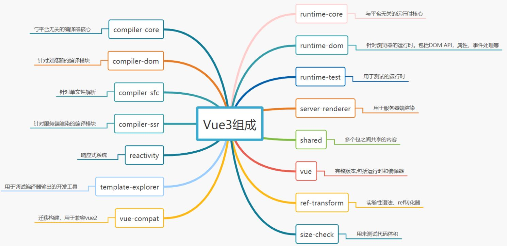

### 1-1. 全局安装pnpm

```bash
npm install pnpm -g #全局安装pnpm
pnpm init -y #初始化配置文件
```

### 1-2. 创建.npmrc文件

```ini
shamefully-hoist =true
```

这里您可以尝试一下安装`Vue3`, `pnpm install vue@next` 此时默认情况下`vue3`中依赖的模块不会被提升到`node_modules` 下。添加**羞耻的提升**可以将`Vue3`所依赖的模块提升到`node_modules` 中

### 1-3. 配置workspace

新建 `pnpm-workspace.yaml`, 配置后install依赖需要加 `-w`

```yaml
packages:
  - 'packages/*'
```

将packages下所有的目录都作为包进行管理。这样我们的Monorepo就搭建好了。确实比lerna +yarn workspace 更快捷

---

### 1-4. 环境搭建

打包项目Vue3采用rollup进行打包代码,安装打包所需要的依赖


| 依赖 | 说明 |
|------|------|
| typescript | 在项目中支持Typescript |
| rollup | 打包工具 |
| rollup-plugin-typescript2 | rollup 和 ts的桥梁 |
| @rollup/plugin-json | 支持引入json |
| @rollup/plugin-node-resolve | 解析node第三方模块 |
| @rollup/plugin-commonjs | 将CommonJS转化为ES6Module |
| minimist | 命令行参数解析 |
| execa@4 | 开启子进程 |

```bash
pnpm install typescript rollup rollup-plugin-typescript2 @rollup/plugin-json @rollup/plugin-node-resolve @rollup/plugin-commonjs minimist execa@4
```

### 1-5. 初始化TS

```bash
pnpm tsc --init
```

先添加些常用的ts-config 配置,后续需要其他的在继续增加

```json
{
  "compilerOptions":{
    "outDir":"dist",//输出的目录
    "sourceMap":true,//采用sourcemap
    "target":"es2016",//目标语法
    "module":"esnext",//模块格式
    "moduleResolution":"node",//模块解析方式
    "strict":false,//严格模式
    "resolveJsonModule":true,//解析json模块
    "esModuleInterop":true,//允许通过es6语法引入commonjs模块
    "jsx":"preserve",//jsx 不转义
    "lib":["esnext","dom"]//支持的类库esnext及dom
  }
}
```

---

### 1-6. 创建模块

我们现在`packages` 目录下新建两个package,用于下一章手写响应式原理做准备

- reactivity 响应式模块
- shared 共享模块

所有包的入口均为`src/index.ts` 这样可以实现统一打包

**`. reactivity/package.json`**

```json
{
  "name":"@vue/reactivity",
  "version":"1.0.0",
  "main":"index.js",
  "module":"dist/reactivity.esm-bundler.js",
  "unpkg":"dist/reactivity.global.js",
  "buildOptions":{
    "name":"VueReactivity",
    "formats":[
      "esm-bundler",
      "cjs",
      "global"
    ]
  }
}
```

**`. shared/package.json`**

```json
{
  "name":"@vue/shared",
  "version":"1.0.0",
  "main":"index.js",
  "module":"dist/shared.esm-bundler.js",
  "buildOptions":{
    "formats":[
      "esm-bundler",
      "cjs"
    ]
  }
}
```

**formats**为自定义的打包格式,有`esm-bundler` 在构建工具中使用的格式、`esm-browser` 在浏览器中使用的格式、`cjs` 在node中使用的格式、`global` 立即执行函数的格式

```bash
pnpm install @vue/shared@workspace --filter @vue/reactivity
```

配置`ts`引用关系
****
```json
{
  "baseUrl": ".",
  "paths":{
    "@vue/*":["packages/*/src"]
  }
}
```

---

### 1-7. 开发环境esbuild 打包

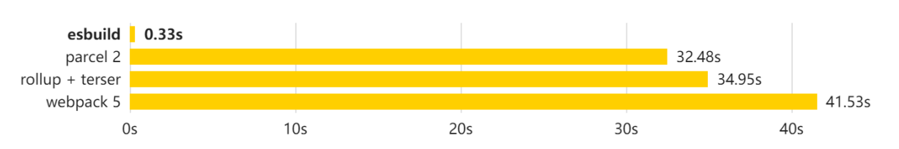

创建开发时执行脚本,参数为要打包的模块

**解析用户参数**

```json
{
  "scripts": {
    "dev":"node scripts/dev.js reactivity -f global"
  }
}
```

```js
const {build} = require('esbuild')
const {resolve} = require('path')
const args = require('minimist')(process.argv.slice(2))

const target = args._[0] || 'reactivity';
const format = args.f || 'global';

const pkg = require(resolve(__dirname, `../packages/${target}/package.json`))

const outputFormat = format.startsWith('global') //输出的格式
  ? 'iife'
  : format === 'cjs'
  ? 'cjs'
  : 'esm'

const outfile = resolve( //输出的文件
  __dirname,
  `../packages/${target}/dist/${target}.${format}.js`
)

build({
  entryPoints: [resolve(__dirname, `../packages/${target}/src/index.ts`)],
  outfile,
  bundle: true,
  sourcemap: true,
  format: outputFormat,
  globalName: pkg.buildOptions?.name,
  platform: format === 'cjs' ? 'node' : 'browser',
  watch: { //监控文件变化
    onRebuild(error){
      if (!error) console.log(`rebuilt~~~~`)
    }
  }
}).then(() => {
  console.log('watching~~~')
})
```

---

### 1-8. 生产环境rollup 打包

**rollup.config.js**

```js
import path from 'path';

//获取packages目录
const packagesDir = path.resolve(__dirname, 'packages');
//获取对应的模块
const packageDir = path.resolve(packagesDir, process.env.TARGET); //全部以打包目录来解析文件
const resolve = p => path.resolve(packageDir, p);
const pkg = require(resolve('package.json'));
const name = path.basename(packageDir); //获取包的名字

//配置打包信息
const outputConfigs = {
  'esm-bundler': {
    file: resolve(`dist/${name}.esm-bundler.js`),
    format: 'es'
  },
  cjs: {
    file: resolve(`dist/${name}.cjs.js`),
    format: 'cjs'
  },
  global: {
    file: resolve(`dist/${name}.global.js`),
    format: 'iife'
  }
}

//获取formats
const packageFormats = process.env.FORMATS && process.env.FORMATS.split(',')
const packageConfigs = packageFormats || pkg.buildOptions.formats

import json from '@rollup/plugin-json'
import commonjs from '@rollup/plugin-commonjs';
import {nodeResolve} from '@rollup/plugin-node-resolve'
import tsPlugin from 'rollup-plugin-typescript2'

function createConfig(format, output) {
  output.sourcemap = process.env.SOURCE_MAP;
  output.exports = 'named';
  let external = []
  if (format === 'global') {
    output.name = pkg.buildOptions.name
  } else { //cjs/esm 不需要打包依赖文件
    external = [...Object.keys(pkg.dependencies || {})]
  }
  return {
    input: resolve('src/index.ts'),
    output,
    external,
    plugins: [
      json(),
      tsPlugin(),
      commonjs(),
      nodeResolve()
    ]
  }
}

//开始打包把
export default packageConfigs.map(format => createConfig(format, outputConfigs[format]))
```

**build.js**

```js
const fs = require('fs');
const execa = require('execa')

const targets = fs.readdirSync('packages').filter(f => {
  if (!fs.statSync(`packages/${f}`).isDirectory()) {
    return false;
  }
  return true;
});

async function runParallel(source, iteratorFn) {
  const ret = [];
  for (const item of source) {
    const p = Promise.resolve().then(() => iteratorFn(item))
    ret.push(p);
  }
  return Promise.all(ret)
}

async function build(target) {
  await execa(
    'rollup',
    [
      '-c',
      '--environment',
      `TARGET:${target}`
    ],
    {stdio: 'inherit'}
  )
}

runParallel(targets, build)
```

---

## 2. Reactivity模块基本使用

```html
<div id="app"></div>
<script src="./reactivity.global.js"></script>
<script>
const {reactive,effect,shallowReactive,shallowReadonly,readonly} = VueReactivity
//let state = reactive({name:'jw',age:30});
//const state = shallowReactive({name:'jw',age:30})
//const state = readonly({name:'jw',age:30})
const state = reactive({name:'jw',age:30})
effect(()=>{//副作用函数(effect执行渲染了页面)
  app.innerHTML = state.name + '今年' + state.age + '岁了'
});
setTimeout(()=>{
  state.age++;
},1000)
</script>
```

`reactive` 方法会将对象变成proxy对象,`effect` 中使用`reactive` 对象时会进行依赖收集,稍后属性变化时会重新执行`effect` 函数~。

### 2-1. 编写reactive函数

```js
import {isObject} from "@vue/shared"

function createReactiveObject(target:object,isReadonly:boolean){
  if (!isObject(target)){
    return target
  }
}
//常用的就是reactive方法
```

```js
export function reactive(target:object){
  return createReactiveObject(target,false)
}
//后面的方法,不是重点我们先不进行实现...
/*
export function shallowReactive(target:object){
  return createReactiveObject(target,false)
}
export function readonly(target:object){
  return createReactiveObject(target,true)
}
export function shallowReadonly(target:object){
  return createReactiveObject(target,true)
}
*/
```

```js
export function isObject(value:unknown):value is Record<any,any>{
  return typeof value === 'object' && value !== null
}
```

由此可知这些方法接受的参数必须是一个对象类型。否则没有任何效果

```js
const reactiveMap = new WeakMap();//缓存列表
const mutableHandlers:ProxyHandler<object> = {
  get(target,key,receiver){
    //等会谁来取值就做依赖收集
    const res = Reflect.get(target,key,receiver);
    return res;
  },
  set(target,key,value,receiver){
    //等会赋值的时候可以重新触发effect执行
    const result = Reflect.set(target,key,value,receiver);
    return result;
  }
}

function createReactiveObject(target:object,isReadonly:boolean){
  if (!isObject(target)){
    return target
  }
  const exisitingProxy = reactiveMap.get(target);//如果已经代理过则返回代理结果
  if (exisitingProxy){
    return exisitingProxy;
  }
  const proxy = new Proxy(target,mutableHandlers);//对对象进行代理
  reactiveMap.set(target,proxy)
  return proxy;
}
```

这里必须要使用Reflect进行操作,保证this指向永远指向代理对象

```js
let school = {
  name:'zf',
  get num(){
    return this.name;
  }
}
let p = new Proxy(school,{
  get(target,key,receiver){
    console.log(key);
    //return Reflect.get(target,key,receiver)
    return target[key]
  }
})
p.num
```

将对象使用proxy进行代理,如果对象已经被代理过,再次重复代理则返回上次代理结果。那么,如果将一个代理对象传入呢?

```js
const enum ReactiveFlags {
  IS_REACTIVE = '__v_isReactive'
}
const mutableHandlers:ProxyHandler<object> = {
  get(target,key,receiver){
    if(key === ReactiveFlags.IS_REACTIVE){//在get中增加标识,当获取此属性时返回true
      return true;
    }
    // ...
  }
}
```

```js
function createReactiveObject(target:object,isReadonly:boolean){
  if(target[ReactiveFlags.IS_REACTIVE]){//在创建响应式对象时先进行取值
    return target
  }
  // ...
}
```

这样我们防止重复代理就做好了~~~,其实这里的逻辑相比Vue2真的是简单太多了。

### 2-2. 编写effect函数

```js
export let activeEffect = undefined;//当前正在执行的effect

class ReactiveEffect {
  active = true;
  deps = [];//收集effect中使用到的属性
  parent = undefined;
  constructor(public fn){}
  run(){
    if (!this.active){//不是激活状态
      return this.fn();
    }
    try {
      this.parent = activeEffect;//当前的effect就是他的父亲
      activeEffect = this;//设置成正在激活的是当前effect
      return this.fn();
    } finally {
      activeEffect = this.parent;//执行完毕后还原activeEffect
      this.parent = undefined;
    }
  }
}

export function effect(fn,options?){
  const _effect = new ReactiveEffect(fn);//创建响应式effect
  _effect.run();//让响应式effect默认执行
}
```

### 2-3. 依赖收集

默认执行effect 时会对属性,进行依赖收集

```js
get(target,key,receiver){
  if (key === ReactiveFlags.IS_REACTIVE){
    return true;
  }
  const res = Reflect.get(target,key,receiver);
  Track(target,'get',key);//依赖收集
  return res;
}
```

```js
const targetMap = new WeakMap();//记录依赖关系
export function track(target,type,key){
  if (activeEffect){
    let depsMap = targetMap.get(target);//{对象:map}
    if (!depsMap){
      targetMap.set(target,(depsMap = new Map()))
    }
    let dep = depsMap.get(key);
    if (!dep){
      depsMap.set(key,(dep = new Set()))//{对象:{属性:[effect]}}
    }
    let shouldTrack = !dep.has(activeEffect)
    if (shouldTrack){
      dep.add(activeEffect);
      activeEffect.deps.push(dep);//让effect记住dep,这样后续可以清理
    }
  }
}
```

将属性和对应的effect维护成映射关系,后续属性变化可以触发对应的effect函数重新run

### 2-4. 触发更新

```js
set(target,key,value,receiver){
  //等会赋值的时候可以重新触发effect执行
  let oldValue = target[key]
  const result = Reflect.set(target,key,value,receiver);
  if (oldValue !== value){
    trigger(target,'set',key,value,oldValue)
  }
  return result;
}
```

```js
export function trigger(target,type,key?,newValue?,oldValue?){
  const depsMap = targetMap.get(target);//获取对应的映射表
  if (!depsMap){
    return
  }
  const effects = depsMap.get(key);
  effects && effects.forEach(effect =>{
    if (effect !== activeEffect) effect.run();//防止循环
  })
}
```

### 2-5. 分支切换与cleanup

在渲染时我们要避免副作用函数产生的遗留

```js
const state = reactive({flag:true,name:'jw',age:30})
effect(()=>{//副作用函数(effect执行渲染了页面)
  consote. Loo 国限
});
document.body.innerHTML =state.flag ?
setTimeout(()=>{
state.flag =
setTimeout(()=>{
  console.log('修改name,原则上不更新')
  state.name = 'zf'
},1000);
},1000)
```

```js
function cleanupEffect(effect){
  const {deps} = effect;//清理effect
  for (let i = 0; i < deps.length; i++){
    deps[i].delete(effect);
  }
  effect.deps.length = 0;
}

class ReactiveEffect {
  active = true;
  deps = [];//收集effect中使用到的属性
  parent = undefined;
  constructor(public fn){}
  run(){
    try {
      this.parent = activeEffect;//当前的effect就是他的父亲
      activeEffect = this;//设置成正在激活的是当前effect
      cleanupEffect(this);
      return this.fn();//先清理在运行
    }
  }
}
```

这里要注意的是:触发时会进行清理操作(清理effect),在重新进行收集(收集effect)。在循环过程中会导致死循环。

```js
let effect = ()=>{};
let s = new Set([effect])
s.forEach(item=>{s.delete(effect);s.add(effect)});//这样就导致死循环
```

### 2-6. 停止effect

```js
export class ReactiveEffect {
  stop(){
    if(this.active){
      cleanupEffect(this);
      this.active = false
    }
  }
}

export function effect(fn,options?){
  const _effect = new ReactiveEffect(fn);
  _effect.run();
  const runner = _effect.run.bind(_effect);
  runner.effect = _effect;
  return runner;//返回runner
}
```

### 2-7. 调度执行

trigger 触发时,我们可以自己决定副作用函数执行的时机、次数、及执行方式

```js
export function effect(fn,options:any = {}){
  const _effect = new ReactiveEffect(fn,options.scheduler);//创建响应式effect
  //if(options){
  //  Object.assign(_effect,options);//扩展属性
  //}
  _effect.run();//让响应式effect默认执行
  const runner = _effect.run.bind(_effect);
  runner.effect = _effect;
  return runner;//返回runner
}
```

```js
export function trigger(target,type,key?,newValue?,oldValue?){
  const depsMap = targetMap.get(target);
  if (!depsMap){
    return
  }
  let effects = depsMap.get(key);
  if (effects) {
    effects = new Set(effects);
    for (const effect of effects) {
      if (effect !== activeEffect) {
        if(effect.scheduler){ // 如果有调度函数则执行调度函数
          effect.scheduler()
        }else{
          effect.run();
        }
      }
    }
  }
}
```

### 2-8. 深度代理

```js
get(target,key,receiver){
  if (key === ReactiveFlags.IS_REACTIVE){
    return true;
  }
  //等会谁来取值就做依赖收集
  const res = Reflect.get(target,key,receiver);
  track(target,'get',key);
  if(isObject(res)){
    return reactive(res);
  }
  return res;
}
```

当取值时返回的值是对象,则返回这个对象的代理对象,从而实现深度代理

---
## 3. Computed和WatcAPIh实现原理

### 3-1. computed
接受一个getter 函数,并根据getter 的返回值返回一个不可变的响应式ref 对象。

```js
import {isFunction} from "@vue/shared";
import {activeEffect,ReactiveEffect,trackEffects,triggerEffects} from "./effect";

class ComputedRefImpl {
  public effect;
  public _value;
  public dep;
  public _dirty = true;
  constructor(getter,public setter){
    this.effect = new ReactiveEffect(getter,()=>{
      if(!this._dirty){//依赖的值变化更新dirty并触发更新
        this._dirty = true;
        triggerEffects(this.dep)
      }
    });
  }
  get value(){//取值的时候进行依赖收集
    if(activeEffect){
      trackEffects(this.dep || (this.dep = new Set));
    }
    if(this._dirty){//如果是脏值,执行函数
      this._dirty = false;
      this._value = this.effect.run();
    }
    return this._value;
  }
  set value(newValue){
    this.setter(newValue)
  }
}
```

```js
export function computed(getterOrOptions){
  const onlyGetter = isFunction(getterOrOptions);//传入的是函数就是只传入getter
  let getter;
  let setter;
  if (onlyGetter){
    getter = getterOrOptions;
    setter = ()=>{}
  } else {
    getter = getterOrOptions.get;
    setter = getterOrOptions.set;
  }
  //创建计算属性
  return new ComputedRefImpl(getter,setter)
}
```

创建ReactiveEffect时,传入scheduler 函数,稍后依赖的属性变化时调用此方法!

```js
export function triggerEffects(effects){
  effects = new Set(effects);
  for (const effect of effects){
    if (effect !== activeEffect){//如果effect不是当前正在运行的effect
      if (effect.scheduler){
        effect.scheduler()
      } else {
        effect.run();//重新执行一遍
      }
    }
  }
}
```

```js
export function trackEffects(dep){//收集dep 对应的effect
  let shouldTrack = !dep.has(activeEffect)
  if (shouldTrack){
    dep.add(activeEffect);
    activeEffect.deps.push(dep);
  }
}
```

### 3-2. WatchAPI实现原理

watch的核心就是观测一个响应式数据,当数据变化时通知并执行回调(那也就是说它本身就是一个effect)

```js
watch(state,(oldValue,newValue)=>{//监测一个响应式值的变化
  console.log(oldValue,newValue)
})
```

#### 3-2-1. 监测响应式对象

```js
function traverse(value,seen = new Set()){
  if(!isObject(value)){
    return value
  }
  if(seen.has(value)){
    return value;
  }
  seen.add(value);
  for(const k in value){//递归访问属性用于依赖收集
    traverse(value[k],seen)
  }
  return value
}
```

```js
export function isReactive(value){
  return !!(value && value[ReactiveFlags.IS_REACTIVE])
}
```

```js
export function watch(source,cb){
  let getter;
  if(isReactive(source)){//如果是响应式对象
    getter = ()=>traverse(source)//包装成effect对应的fn,函数内部
  }
  let oldValue;
  const job = ()=>{
    const newValue = effect.run();//值变化时再次运行effect函数,获取新值
    cb(newValue,oldValue);
    oldValue = newValue
  }
  const effect = new ReactiveEffect(getter,job)//创建effect
  oldValue = effect.run();//运行保存老值
}
```

#### 3-2-2. 监测函数

```js
export function watch(source,cb){
  let getter;
  if(isReactive(source)){//如果是响应式对象
    getter = ()=>traverse(source)
  } else if(isFunction(source)){
    getter = source //如果是函数则让函数作为fn即可
  }
  //...
}
```

#### 3-2-3. watch中回调执行时机

```js
export function watch(source,cb,{immediate}={}as any){
  const effect = new ReactiveEffect(getter,job)//创建effect
  if(immediate){//需要立即执行,则立刻执行任务
    job();
  }
  oldValue = effect.run();
}
```

#### 3-2-4. watch中cleanup实现

连续触发watch时需要清理之前的watch操作

```js
const state = reactive({flag:true,name:'jw',age:30})
let i = 2000;
function getData(timer){
  return new Promise((resolve,reject)=>{
    setTimeout(()=>{
      resolve(timer)
    },timer);
  })
}
watch(()=>state.age,async (newValue,oldValue,onCleanup)=>{
  let clear = false;
  onCleanup(()=>{
    clear = true;
  })
  i-=1000;
  let r = await getData(i);//第一次执行1s后渲染1000,第二次执行0s后
  if(!clear){
    document.body.innerHTML = r;
  }
},{flush:'sync'});
state.age = 31;
state.age = 32;
```

```js
let cleanup;
let onCleanup = (fn)=>{
  cleanup = fn;
}
const job = ()=>{
  const newValue = effect.run();
  if(cleanup) cleanup();//下次watch执行前调用上次注册的回调
  cb(newValue,oldValue,onCleanup);//传入onCleanup函数
  oldValue = newValue
}
```

---

## 4. Ref的概念

proxy代理的目标必须是非原始值,所以reactive不支持原始值类型。所以我们需要将原始值类型进行包装。

```js
const flag = ref(false)
effect(()=>{
  document.body.innerHTML = flag.value ? 30 : '姜文'
});
setTimeout(()=>{
  flag.value = true
},1000);
```

### 4-1. Ref & ShallowRef

```js
function createRef(rawValue,shallow){
  return new RefImpl(rawValue,shallow);//将值进行装包
}
//将原始类型包装成对象,同时也可以包装对象进行深层代理
export function ref(value){
  return createRef(value,false);
}
//创建浅ref 不会进行深层代理
export function shallowRef(value){
  return createRef(value,true);
}

function toReactive(value){//将对象转化为响应式的
  return isObject(value) ? reactive(value) : value
}
```

```js
class RefImpl {
  public _value;
  public dep;
  public __v_isRef = true;
  constructor(public rawValue,public _shallow){
    this._value = _shallow ? rawValue : toReactive(rawValue);//
  }
  get value(){
    if(activeEffect){
      trackEffects(this.dep || (this.dep = new Set));//收集依赖
    }
    return this._value;
  }
  set value(newVal){
    if(newVal !== this.rawValue){
      this.rawValue = newVal;
      this._value = this._shallow ? newVal : toReactive(newVal);
      triggerEffects(this.dep);//触发更新
    }
  }
}
```

### 4-2. toRef & toRefs

响应式丢失问题

```js
const state = reactive({name:'jw',age:30})
let person = {...state}
effect(()=>{
  document.body.innerHTML = person.name + '今年' + person.age + '岁了'
})
setTimeout(()=>{
  person.age = 31;
},1000)
```

如果将响应式对象展开则会丢失响应式的特性

```js
class ObjectRefImpl {
  public __v_isRef = true
  constructor(public _object,public _key){}
  get value(){
    return this._object[this._key];
  }
  set value(newVal){
    this._object[this._key] = newVal;
  }
}

export function toRef(object,key){//将响应式对象中的某个属性转化成ref
  return new ObjectRefImpl(object,key);
}

export function toRefs(object){//将所有的属性转换成ref
  const ret = Array.isArray(object) ? new Array(object.length) : {};
  for (const key in object){
    ret[key] = toRef(object,key);
  }
  return ret;
}
```

```js
let person = {...toRefs(state)};//解构的时候将所有的属性都转换成ref即可
effect(()=>{
  document.body.innerHTML = person.name.value + '今年' + person.age.value + '岁了'
})
setTimeout(()=>{
  person.age.value = 31;
},1000)
```

### 4-3. 自动脱ref

```js
let person = proxyRefs({...toRefs(state)})
effect(()=>{
  document.body.innerHTML = person.name + '今年' + person.age + '岁了'
})
setTimeout(()=>{
  person.age = 31;
},1000)
```

```js
export function proxyRefs(objectWithRefs){ // 代理的思想,如果是ref 则取ref.value
  return new Proxy(objectWithRefs,{
    get(target,key,receiver){
      let v = Reflect.get(target,key,receiver);
      return v.__v_isRef ? v.value : v;
    },
    set(target,key,value,receiver){ // 设置的时候如果是ref,则给ref.value赋值
      const oldValue = target[key];
      if(oldValue.__v_isRef){
        oldValue.value = value;
        return true
      } else {
        return Reflect.set(target,key,value,receiver)
      }
    }
  })
}
```

---
## 5. 渲染器
渲染器的作⽤是把虚拟DOM渲染为特定平台上的真实元素。在浏览器中，渲染器会把虚拟DOM渲染成真实DOM元素。
```ts
const {createRenderer,h} = Vue
const renderer = createRenderer({
createElement(element){
return document.createElement(element);
},
setElementText(el,text){
el.innerHTML = text
},
insert(el,container){
container.appendChild(el)
}
});
renderer.render(h('h1','hello world'),document.getElementById('app'))
```
### 5-1. 创建runtime-dom包

runtime-dom 针对浏览器运行时，包括DOM API、属性、事件处理等。

**`runtime-dom/package.json`**

```json
{
  "name": "@vue/runtime-dom",
  "main": "index.js",
  "module": "dist/runtime-dom.esm-bundler.js",
  "unpkg": "dist/runtime-dom.global.js",
  "buildOptions": {
    "name": "VueRuntimeDOM",
    "formats": [
      "esm-bundler",
      "cjs",
      "global"
    ]
  }
}
```

安装依赖：

```sh
pnpx install @vue/shared@workspace --filter @vue/runtime-dom
```

### 5-2. 实现节点常用操作

`runtime-dom/src/nodeOps` 这里存放常见DOM操作API，不同运行时提供的具体实现不一样，最终将操作方法传递到 `runtime-core` 中，所以 `runtime-core` 不需要关心平台相关代码~

```javascript
export const nodeOps = {
    insert: (child, parent, anchor) => { // 添加节点
        parent.insertBefore(child, anchor || null);
    },
    remove: child => { // 节点删除
        const parent = child.parentNode;
        if (parent) {
            parent.removeChild(child);
        }
    },
    createElement: (tag) => document.createElement(tag), // 创建节点
    createText: text => document.createTextNode(text), // 创建文本
    setText: (node, text) => node.nodeValue = text, // 设置文本节点内容
    setElementText: (el, text) => el.textContent = text, // 设置元素文本
    parentNode: node => node.parentNode, // 父亲节点
    nextSibling: node => node.nextSibling, // 下一个节点
    querySelector: selector => document.querySelector(selector) // 查找元素
}
```

### 5-3. 比对属性方法

```javascript
export const patchProp = (el, key, prevValue, nextValue) => {
    if (key === 'class') {
        patchClass(el, nextValue)
    } else if (key === 'style') {
        patchStyle(el, prevValue, nextValue);
    } else if (/^on[a-z]/.test(key)) {
        patchEvent(el, key, nextValue)
    } else {
        patchAttr(el, key, nextValue)
    }
}
```

#### 5-3-1. 操作类名

```javascript
function patchClass(el, value) { // 根据最新值设置类名
  if (value == null) {
    el.removeAttribute('class');
  } else {
    el.className = value;
  }
}
```

#### 5-3-2. 操作样式

```javascript
function patchStyle(el, prev, next) { // 更新 style
  const style = el.style;
  for (const key in next) { // 用最新的直接覆盖
    style[key] = next[key]
  }
  if (prev) {
    for (const key in prev) { // 老的有新的没有则删除
      if (next[key] == null) {
        style[key] = null
      }
    }
  }
}
```

#### 5-3-3. 操作事件

```javascript
function createInvoker(initialValue) {
  const invoker = (e) => invoker.value(e);
  invoker.value = initialValue;
  return invoker;
}

function patchEvent(el, rawName, nextValue) { // 更新事件
  const invokers = el._vei || (el._vei = {});
  const existingInvoker = invokers[rawName]; // 是否缓存过

  if (nextValue && existingInvoker) {
    existingInvoker.value = nextValue;
  } else {
    const name = rawName.slice(2).toLowerCase(); // 转化事件名是小写
    if (nextValue) { // 缓存函数
        const invoker = (invokers[rawName] = createInvoker(nextValue));
        el.addEventListener(name, invoker);
    } else if (existingInvoker) {
        el.removeEventListener(name, existingInvoker);
        invokers[rawName] = undefined;
    }
  }
}
```

在绑定事件的时候，绑定一个伪造的事件处理函数invoker，把真正的事件处理函数设置为invoker.value属性的值。

#### 5-3-4. 操作属性

```javascript
function patchAttr(el, key, value) { // 更新属性
    if (value == null) {
        el.removeAttribute(key);
    } else {
        el.setAttribute(key, value);
    }
}
```

### 5-4. 创建渲染器

最终我们在 index.js 中引入写好的方法，渲染选项就准备好了。稍后将虚拟DOM转化成真实DOM会调用这些方法。

```javascript
import { nodeOps } from "./nodeOps"
import { patchProp } from "./patchProp"

// 准备好所有渲染时所需要的属性
const renderOptions = Object.assign({patchProp}, nodeOps);
createRenderer(renderOptions).render(
  h('h1', 'jw'),
  document.getElementById('app')
);
```

createRenderer接受渲染所需的方法，h方法为创建虚拟节点的方法。这两个方法和平台无关，所以我们将这两个方法在runtime-core中实现。

## 6. 虚拟dom
### 6-1. 创建runtime-core包

runtime-core 不关心运行平台。

**`runtime-core/package.json`**

```json
{
  "name": "@vue/runtime-core",
  "module": "dist/runtime-core.esm-bundler.js",
  "types": "dist/runtime-core.d.ts",
  "files": [
    "index.js",
    "dist"
  ],
  "buildOptions": {
    "name": "VueRuntimeCore",
    "formats": [
      "esm-bundler",
      "cjs"
    ]
  }
}
```

`runtime-core` 中需要依赖 `@vue/shared` 及 `@vue/reactivity`

```bash
pnpm install @vue/shared@workspace @vue/reactivity@workspace --filter
```

最后我们将开发环境下的打包入口改为 runtime-dom。

### 6-2. 虚拟节点的实现

#### 6-2-1. 形状标识

通过组合可以描述虚拟节点的类型。

```typescript
export const enum ShapeFlags { // vue3提供的形状标识
    ELEMENT = 1,
    FUNCTIONAL_COMPONENT = 1 << 1,
    STATEFUL_COMPONENT = 1 << 2,
    TEXT_CHILDREN = 1 << 3,
    ARRAY_CHILDREN = 1 << 4,
    SLOTS_CHILDREN = 1 << 5,
    TELEPORT = 1 << 6,
    SUSPENSE = 1 << 7,
    COMPONENT_SHOULD_KEEP_ALIVE = 1 << 8,
    COMPONENT_KEPT_ALIVE = 1 << 9,
    COMPONENT = ShapeFlags.STATEFUL_COMPONENT | ShapeFlags.FUNCTIONAL
}
```

#### 6-2-2. createVNode实现

```typescript
export function isVNode(value: any) {
    return value ? value.__v_isVNode === true : false
}

export const createVNode = (type, props, children = null) => {
    const shapeFlag = isString(type) ? ShapeFlags.ELEMENT : 0;
    const vnode = {
        __v_isVNode: true,
        type,
        props,
        key: props && props['key'],
        el: null,
        children,
        shapeFlag
    }
    if (children) {
        let type = 0;
        if (Array.isArray(children)) {
            type = ShapeFlags.ARRAY_CHILDREN;
        } else {
            children = String(children);
            type = ShapeFlags.TEXT_CHILDREN
        }
        vnode.shapeFlag |= type
        // 如果shapeFlag为9 说明元素中包含一个文本
        // 如果shapeFlag为17 说明元素中有多个子节点
    }
    return vnode;
}
```

createVNode的写法比较死板，我们让他变的更灵活些。

#### 6-2-3. h实现

```typescript
export function h(type, propsOrChildren?, children?) {
    const l = arguments.length;
    if (l === 2) { // 只有属性，或者一个元素儿子的时候
        if (isObject(propsOrChildren) && !Array.isArray(propsOrChildren)) {
            if (isVNode(propsOrChildren)) { // h('div',h('span'))
                return createVNode(type, null, [propsOrChildren])
            }
            return createVNode(type, propsOrChildren); // h('div',{...})
        } else { // 传递儿子列表的情况
            return createVNode(type, null, propsOrChildren); // h('div', [...])
        }
    } else {
        if (l > 3) { // 超过3个除了前两个都是儿子
            children = Array.prototype.slice.call(arguments, 2);
        } else if (l === 3 && isVNode(children)) {
            children = [children]; // 儿子是元素将其包装成 h('div',null,[...])
        }
        return createVNode(type, propsOrChildren, children) // h('div',...)
    }
    // 注意子节点是：数组、文本、null
}
```

#### 6-2-4. createRenderer实现

render方法就是采用runtime-dom所提供的方法将虚拟节点转化成对应平台的真实节点渲染到指定容器中。

```typescript
export function createRenderer(options) {
  const {
      insert: hostInsert,
      remove: hostRemove,
      patchProp: hostPatchProp,
      createElement: hostCreateElement,
      createText: hostCreateText,
      setText: hostSetText,
      setElementText: hostSetElementText,
      parentNode: hostParentNode,
      nextSibling: hostNextSibling,
  } = options
  
  const patch = (n1, n2, container) => {
      // 初始化和diff算法都在这里哟
  }
  
  const render = (vnode, container) => {
      if (vnode == null) {
          if (container._vnode) { } // 卸载
      } else {
          patch(container._vnode || null, vnode, container); // 初始化
      }
      container._vnode = vnode;
  }
  
  return {
      render
  }
}
```

#### 6-2-5. 创建真实DOM

```typescript
const mountChildren = (children, container) => {
    for (let i = 0; i < children.length; i++) {
        patch(null, children[i], container);
    }
}

const mountElement = (vnode, container) => {
    const { type, props, shapeFlag } = vnode
    let el = vnode.el = hostCreateElement(type); // 创建真实元素，挂载到
    if (props) { // 处理属性
        for (const key in props) { // 更新元素属性
            hostPatchProp(el, key, null, props[key]);
        }
    }
    if (shapeFlag & ShapeFlags.TEXT_CHILDREN) { // 文本
        hostSetElementText(el, vnode.children);
    } else if (shapeFlag & ShapeFlags.ARRAY_CHILDREN) { // 多个儿子
        mountChildren(vnode.children, el);
    }
    hostInsert(el, container); // 插入到容器中
}

const patch = (n1, n2, container) => {
    // 初始化和diff算法都在这里哟
    if (n1 == n2) {
        return
    }
    if (n1 == null) { // 初始化的情况
        mountElement(n2, container);
    } else {
        // diff算法
    }
}
```

#### 6-2-6. 卸载DOM

```typescript
createRenderer(renderOptions).render(null, document.getElementById('app'))
```

```typescript
const unmount = (vnode) => {
    hostRemove(vnode.el)
}

const render = (vnode, container) => {
  if (vnode == null) {
    if (container._vnode) { // 卸载
      unmount(container._vnode); // 找到对应的真实节点将其卸载
    }
  } else {
    patch(container._vnode || null, vnode, container); // 初始化和更新
  }
  container._vnode = vnode;
}
```

#### 6-2-7. 优化调用方法

```typescript
export const render = (vnode, container) => {
    createRenderer(renderOptions).render(vnode, container)
}

export * from "@vue/runtime-core";
```

这样在页面中可以直接调用 `render` 方法进行渲染啦~

## 7. diff流程
## 7-1. 前后元素不一致

两个不同虚拟节点不需要进行比较，直接移除老节点，将新的虚拟节点渲染成真实DOM进行挂载即可

```javascript
export const isSameVNodeType = (n1, n2) => {
    return n1.type === n2.type && n1.key === n2.key;
}

const patch = (n1,n2,container) => {
    // 初始化和diff算法都在这里喲
    if(n1 == n2){return }
    if(n1 && !isSameVNodeType(n1,n2)){ // 有n1 是n1和n2不是同一个节点
        unmount(n1)
        n1 = null
    }
    if(n1 == null){ // 初始化的情况
        mountElement(n2,container); 
    }else{
        // diff算法
    }
}
```
### 7-2. 前后元素一致
前后元素一致则比较两个元素的属性和孩子节点
```js
const patchElement = (n1, n2) => {
    let el = (n2.el = n1.el);
    const oldProps = n1.props || {};
    const newProps = n2.props || {};
    patchProps(oldProps, newProps, el); // 比对新属性
    patchChildren(n1, n2, el); // 比较元素的孩子节点
}

const processElement = (n1, n2, container) => {
    if (n1 == null) {
        mountElement(n2, container)
    } else {
        patchElement(n1, n2); // 比较两个元素
    }
}
```

### 7-3. 子元素比较情况

| 新儿子 | 旧儿子 | 操作方式 |
|--------|--------|----------|
| 文本 | 数组 | （删除老儿子，设置文本内容） |
| 文本 | 文本 | （更新文本即可） |
| 文本 | 空 | （更新文本即可) 与上面的类似 |
| 数组 | 数组 | （diff算法） |
| 数组 | 文本 | （清空文本，进行挂载） |
| 数组 | 空 | （进行挂载） 与上面的类似 |
| 空 | 数组 | （删除所有儿子） |
| 空 | 文本 | （清空文本） |
| 空 | 空 | （无需处理） |

```javascript
const unmountChildren = (children) =>{
    for(let i = 0 ; i < children.length; i++){
        unmount(children[i]);
    }
}
const patchChildren = (n1,n2,el) => {
    const c1 = n1 && n1.children
    const c2 = n2.children
    const prevShapeFlag = n1.shapeFlag;
    const shapeFlag = n2.shapeFlag;
    if(shapeFlag & ShapeFlags.TEXT_CHILDREN){
        if(prevShapeFlag & ShapeFlags.ARRAY_CHILDREN){
            unmountChildren(c1);
        }
        if(c1 !== c2){
            hostSetElementText(el,c2);
        }
    }else {
        if(prevShapeFlag & ShapeFlags.ARRAY_CHILDREN){
            if(shapeFlag & ShapeFlags.ARRAY_CHILDREN){
            }else{
                unmountChildren(c1);
            }
        }else{
            if(prevShapeFlag & ShapeFlags.TEXT_CHILDREN){
                hostSetElementText(el,'');
            }
            if (shapeFlag & ShapeFlags.ARRAY_CHILDREN) {
                mountChildren(c2, el);
            }
        }
    }
}
```

### 7-4. 核心Diff算法

#### 7-4-1. sync from start

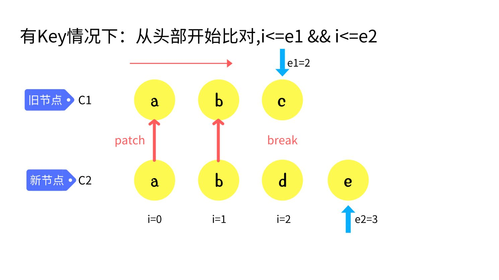

```javascript
h('div',[
     h('li', { key: 'a' }, 'a'),
     h('li', { key: 'b' }, 'b'),
     h('li', { key: 'c' }, 'c')
 ]) : 
 h('div',[
     h('li', { key: 'a' }, 'a'),
     h('li', { key: 'b' }, 'b'),
     h('li', { key: 'd' }, 'd'),
     h('li', { key: 'e' }, 'e')
 ])

const patchKeydChildren = (c1, c2, container) => {
    let i = 0;
    const l2 = c2.length;
    let e1 = c1.length - 1;
    let e2 = l2 - 1;
    // 1. sync from start
    // (a b) c
    // (a b) d e
    while (i <= e1 && i <= e2) {
        const n1 = c1[i];
        const n2 = c2[i];
        if (isSameVNodeType(n1, n2)) {
            patch(n1, n2, container)
        } else {
            break;
        }
        i++;
    }
}
```

#### 7-4-2. sync from end
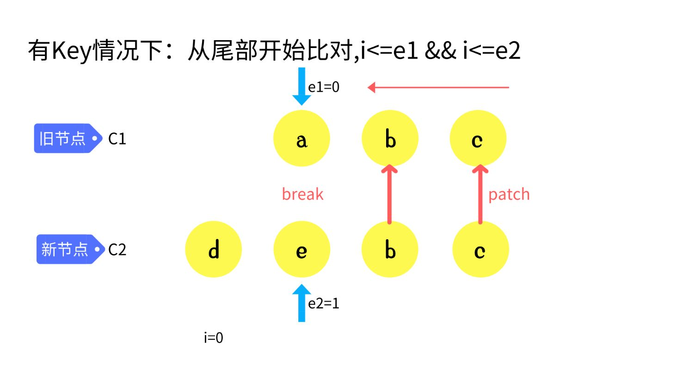

```javascript
// 2. sync from end
// a (b c)
// d e (b c)
while (i <= e1 && i <= e2) {
    const n1 = c1[e1];
    const n2 = c2[e2];
    if (isSameVNodeType(n1, n2)) {
        patch(n1, n2, container);
    } else {
        break;
    }
    e1--;
    e2--;
}
```

#### 7-4-3. common sequence + mount
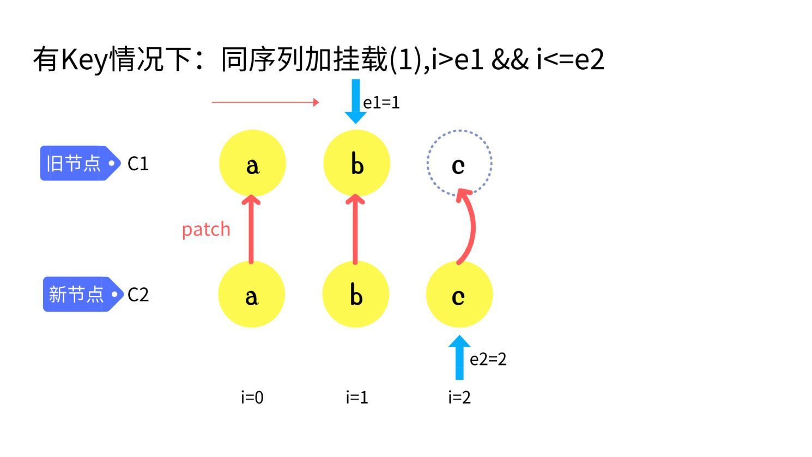
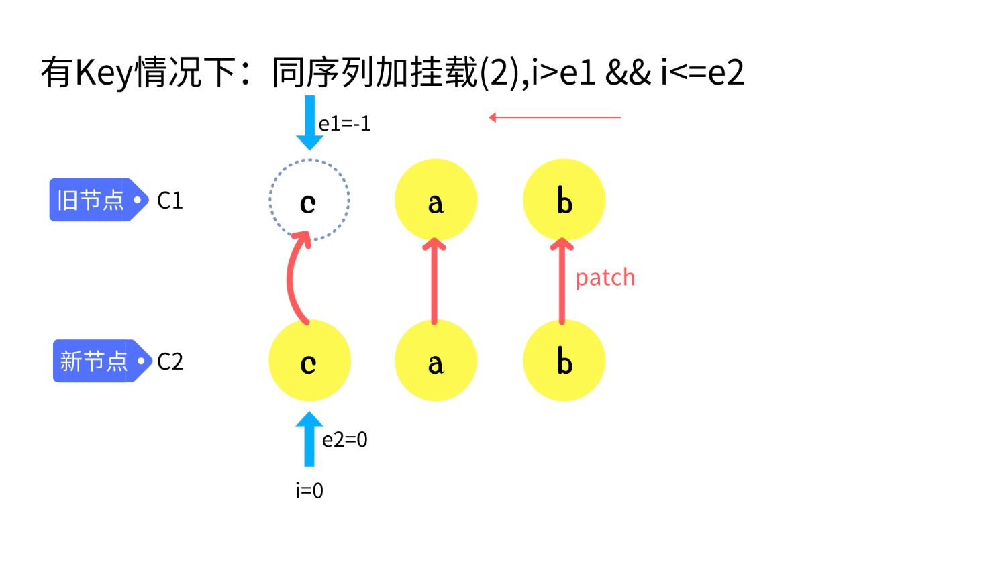
```javascript
// 3. common sequence + mount
// (a b)
// (a b) c
// i = 2, e1 = 1, e2 = 2
// (a b)
// c (a b)
// i = 0, e1 = -1, e2 = 0
if (i > e1) { // 说明有新增 
    if (i <= e2) { // 表示有新增的部分
        // 先根据e2 取他的下一个元素  和 数组长度进行比较
        const nextPos = e2 + 1;
        const anchor = nextPos < c2.length ? c2[nextPos].el : null;
        while (i <= e2) {
            patch(null, c2[i], container, anchor);
            i++;
        }
    }
}
```

#### 7-4-4. common sequence + unmount
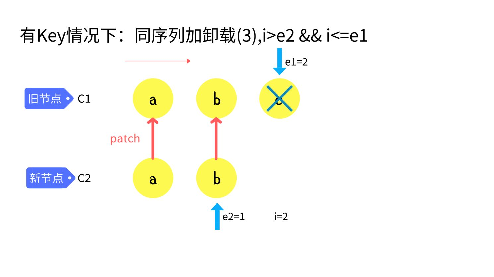
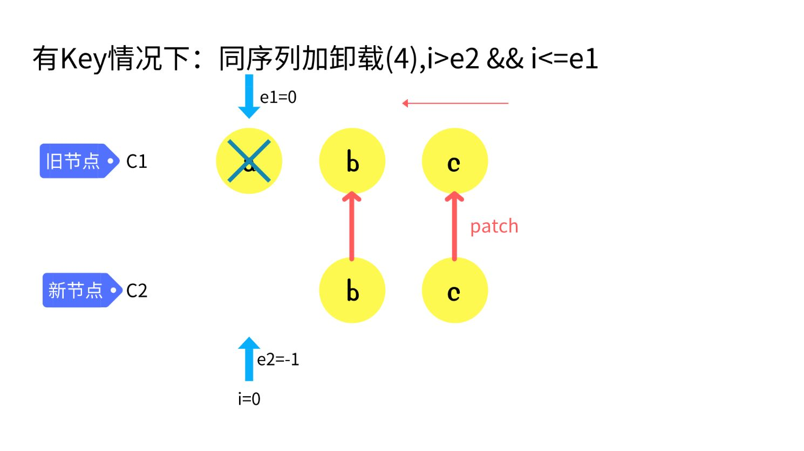
```javascript
// 4. common sequence + unmount
// (a b) c
// (a b)
// i = 2, e1 = 2, e2 = 1
// a (b c)
// (b c)
// i = 0, e1 = 0, e2 = -1
else if (i > e2) {
    while (i <= e1) {
        unmount(c1[i])
        i++
    }
}
```

#### 7-4-5. unknown sequence
`build key:index map for newChildren`
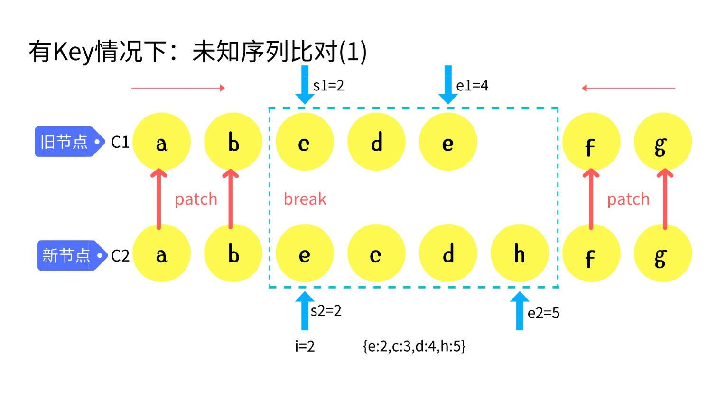
```javascript
// 5. unknown sequence
// a b [c d e] f g
// a b [e c d h] f g
// i = 2, e1 = 4, e2 = 5
const s1 = i;
const s2 = i;
const keyToNewIndexMap = new Map();
for (let i = s2; i <= e2; i++) {
    const nextChild = c2[i];
    keyToNewIndexMap.set(nextChild.key, i);
}
```
**`loop through old children left to be patched and try to patch`**
```js
const toBePatched = e2 - s2 + 1;
const newIndexToOldMapIndex = new Array(toBePatched).fill(0);
for (let i = s1; i <= e1; i++) {
    const prevChild = c1[i];
    let newIndex = keyToNewIndexMap.get(prevChild.key); // 获取新的索引
    if (newIndex == undefined) {
        unmount(prevChild); // 老的有 新的没有直接删除
    } else {
        newIndexToOldMapIndex[newIndex - s2] = i + 1;
        patch(prevChild, c2[newIndex], container);
    }
}
```

**`move and mount`**
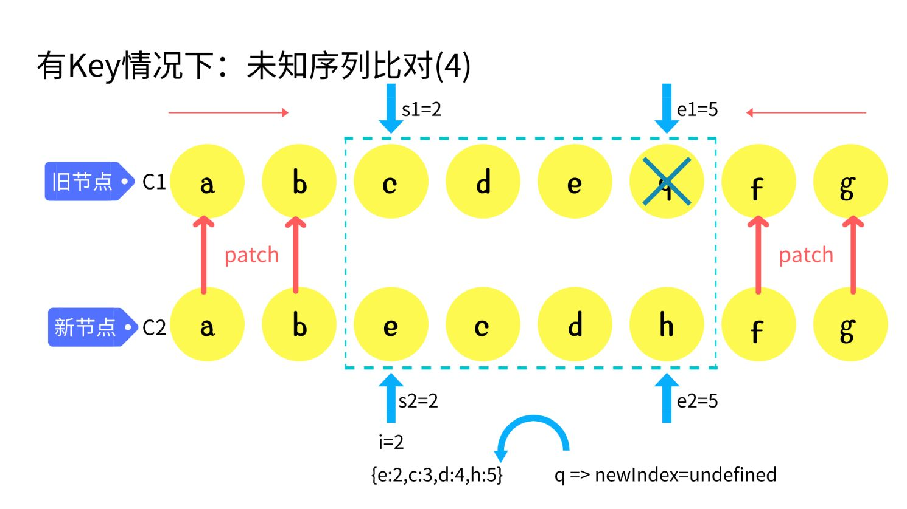
```javascript
for (let i = toBePatched - 1; i >= 0; i--) {
    const nextIndex = s2 + i; // [ecdh]   找到h的索引 
    const nextChild = c2[nextIndex]; // 找到 h
    let anchor = nextIndex + 1 < c2.length ? c2[nextIndex + 1].el : null
    if (newIndexToOldMapIndex[i] == 0) { // 这是一个新元素 直接创建插入到
        patch(null, nextChild, container, anchor)
    } else {
        // 根据参照物 将节点直接移动过去  所有节点都要移动 （但是有些节点可以不
        hostInsert(nextChild.el, container, anchor);
    }
}
```

### 7-5. 最长递增子序列

#### 7-5-1. 最优情况
Vue3 采用最长递增子序列，求解不需要移动的元素有哪些
```javascript
function getSequence(arr) {
    const len = arr.length;
    const result = [0]; // 保存最长递增子序列的索引
    let resultLastIndex;
    for (let i = 0; i < len; i++) {
        const arrI = arr[i]; // 获取数组中的每一项，但是0 没有意义我们需要
        if (arrI !== 0) {
            resultLastIndex = result[result.length - 1];
            if (arr[resultLastIndex] < arrI) {
                result.push(i); // 记录索引
                continue
            }
        }
    }
    return result
}
// 针对默认递增的序列进行优化
console.log(getSequence([2, 6, 7, 8, 9, 11]))
```
#### 7-5-1. 二分查找查找最长递增个数

```javascript
function getSequence1(arr) {
    const len = arr.length;
    const result = [0]; // 保存最长递增子序列的索引
    let resultLastIndex;
    let start;
    let end;
    let middle = 0;
    for (let i = 0; i < len; i++) {
        const arrI = arr[i]; // 获取数组中的每一项，但是0 没有意义我们需要
        if (arrI !== 0) {
            resultLastIndex = result[result.length - 1];
            if (arr[resultLastIndex] < arrI) {
                result.push(i); // 记录索引
                continue
            }
            start = 0;
            end = result.length - 1; // 二分查找 前后索引
            while (start < end) { // 最终start = end 
                middle = ((start + end) / 2) | 0; // 向下取整
                // 拿result中间值和最后一项比较
                if (arr[result[middle]] < arrI) { // 找比arrI大的值 或
                    start = middle + 1;
                } else {
                    end = middle;  
                }
            }
            if (arrI < arr[result[start]]) { // 当前这个小就替换掉
                result[start] = i; 
            }
        }
    }
    return result
}
```
**`前驱节点追溯`**
假设有：-2,3,1,5,6,8,7,9,4 为最新序列 8 按照上述结果得出的结论为：- 2, 1, 8, 4, 6, 7 7
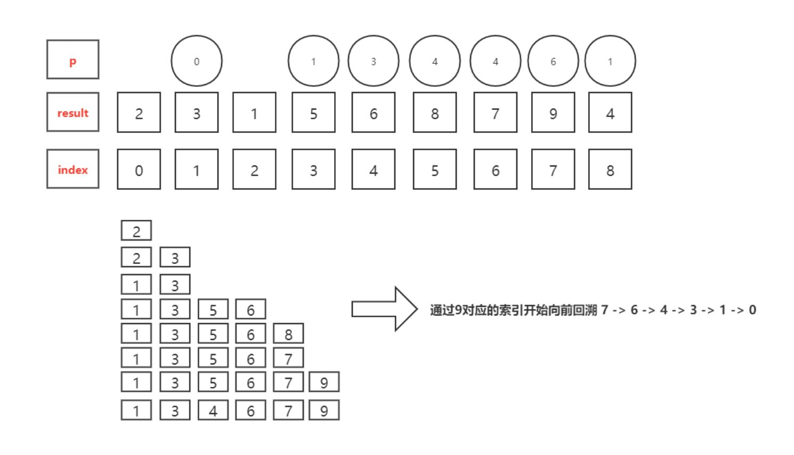
```javascript
function getSequence(arr) { // 最终的结果是索引 
    const len = arr.length;
    const result = [0]; // 索引  递增的序列 用二分查找性能高
    const p = arr.slice(0); // 里面内容无所谓 和 原本的数组相同 用来存放索
    let start;
    let end;
    let middle;
    for (let i = 0; i < len; i++) { // O(n)
        const arrI = arr[i];
        if (arrI !== 0) {
            let resultLastIndex = result[result.length - 1];
            // 取到索引对应的值
            if (arr[resultLastIndex] < arrI) {
                p[i] = resultLastIndex; // 标记当前前一个对应的索引
                result.push(i);
                // 当前的值 比上一个人大 ，直接push ，并且让这个人得记录他的
                continue
            }
            // 二分查找 找到比当前值大的那一个
            start = 0;
            end = result.length - 1;
            while (start < end) { // 重合就说明找到了 对应的值  // O(log
                middle = ((start + end) / 2) | 0; // 找到中间位置的前一
                if (arr[result[middle]] < arrI) {
                    start = middle + 1
                } else {
                    end = middle
                } // 找到结果集中，比当前这一项大的数
            }
            // start / end 就是找到的位置
            if (arrI < arr[result[start]]) { // 如果相同 或者 比当前的还
                if (start > 0) { // 才需要替换
                    p[i] = result[start - 1]; // 要将他替换的前一个记住
                }
                result[start] = i;
            }
        }
    }
    let i = result.length // 总长度
    let last = result[i - 1] // 找到了最后一项
    while (i-- > 0) { // 根据前驱节点一个个向前查找
        result[i] = last // 最后一项肯定是正确的
        last = p[last]
    }
    return result;
}
console.log(getSequence([2, 3, 1, 5, 6, 8, 7, 9, 4]))
```

#### 7-5-3优化Diff 算法
利用最长递增子序列，优化Diff 算法

```ts
// [5,3,4,0] => [1,2]
let increasingNewIndexSequence = getSequence(newIndexToOldMapIndex);
let j = increasingNewIndexSequence.length - 1; // 取出最后一个人的索引
for (let i = toBePatched - 1; i >= 0; i--) {
    let currentIndex = i + s2; // 找到h的索引
    let child = c2[currentIndex]; // 找到h对应的节点
    let anchor = currentIndex + 1 < c2.length ? c2[currentIndex + 1].el : null
    if (newIndexToOldMapIndex[i] == 0) { // 如果自己是0说明没有被patch过
        patch(null, child, container, anchor)
    } else {
        if (i != increasingNewIndexSequence[j]) {
            hostInsert(child.el, container, anchor); // 操作当前的d 以
        } else {
            j--; // 跳过不需要移动的元素， 为了减少移动操作 需要这个最长递增子
        }
    }
}
```

## 8. Text和Fragment

除了元素虚拟节点之外，Vue3中还有很多其他类型的虚拟节点，这里我们先来说下Text和Fragment的实现。

```javascript
export const Text = Symbol('Text')
export const Fragment = Symbol('Fragment')
```

### 8-1.文本类型

```javascript
renderer.render(h(Text, 'jw handsome'), document.getElementById('app'))
```

```javascript
const patch = (n1, n2, container, anchor?) => {
  // 初始化和diff算法都在这里哟
  if (n1 === n2) { return }
  if (n1 && !isSameVNodeType(n1, n2)) { // 有n1 是n1和n2不是同一个节点
    unmount(n1)
    n1 = null
  }
  const { type, shapeFlag } = n2;
  switch (type) {
    case Text:
      processText(n1, n2, container); // 处理文本
      break;
    case Fragment:
      processFragment(n1, n2, container); // 处理fragment
      break;
    default:
      if (shapeFlag & ShapeFlags.ELEMENT) {
        processElement(n1, n2, container, anchor); // 之前处理元素
      }
  }
}
```

```javascript
const processText = (n1, n2, container) => {
  if (n1 == null) {
    hostInsert((n2.el = hostCreateText(n2.children)), container)
  } else {
    const el = n2.el = n1.el;
    if (n2.children != n1.children) {
      hostSetText(el, n2.children)
    }
  }
}
```

### 8-2. Fragment类型

```javascript
renderer.render(h(Fragment, [h(Text, 'hello'), h(Text, 'jw')]), document.
```

```javascript
const processFragment = (n1, n2, container) => {
  if (n1 == null) {
    mountChildren(n2.children, container);
  } else {
    patchChildren(n1, n2, container);
  }
}
```

为了让Vue3支持多根节点模板，Vue.js 提供Fragment来实现，核心就是一个无意义的标签包裹多个节点。

同时这里要处理下卸载的逻辑，如果是fragment则删除子元素：

```javascript
const unmount = (vnode) => {
  if (vnode.type === Fragment) {
    return unmountChildren(vnode.children)
  }
  hostRemove(vnode.el)
}
```

## 9. 组件渲染
### 9-1 组件的挂载流程

组件需要一个 render 函数，渲染函数需要返回虚拟 DOM。

```js
const VueComponent = {
  data() {
    return { age: 13 }
  },
  render() {
    return h('p', [h(Text, "I'm Jiang sir"), h('span', this.age + '')])
  }
}
createRenderer(renderOptions).render(h(VueComponent), document.getElementById('app'))
```

#### 9-1-1 添加组件类型

`h` 方法中传入一个对象说明要渲染的是一个组件。（后续还有其他可能）

```js
export const createVNode = (type, props, children = null) => {
  const shapeFlag = isString(type)
    ? ShapeFlags.ELEMENT
    : isObject(type)
      ? ShapeFlags.STATEFUL_COMPONENT
      : 0;
  // ... 稍后可以根据类型来进行组件的挂载
}
```

####  9-1-2 组件的渲染

```js
const patch = (n1, n2, container, anchor?) => {
  // 初始化和 diff 算法都在这里哟
  if (n1 == n2) { return }
  if (n1 && !isSameVNodeType(n1, n2)) { // 有n1 是n1和n2不是同一个节点
    unmount(n1)
    n1 = null
  }
  const { type, shapeFlag } = n2;
  switch (type) {
    // ...
    default:
      if (shapeFlag & ShapeFlags.ELEMENT) {
        processElement(n1, n2, container, anchor)
      } else if (shapeFlag & ShapeFlags.COMPONENT) {
        processComponent(n1, n2, container, anchor)
      }
  }
}
```

```js
const mountComponent = (n2, container, anchor) => {
  const { render, data = () => ({}) } = n2.type;
  const state = reactive(data())
  const instance = {
    state, // 组件的状态
    isMounted: false, // 组件是否挂载
    subtree: null, // 子树
    update: null,
    vnode: n2
  }
  const componentUpdateFn = () => {
    if (!instance.isMounted) {
      const subtree = render.call(state, state);
      patch(null, subtree, container, anchor);
      instance.subtree = subtree
      instance.isMounted = true;
    } else {
      const subtree = render.call(state, state);
      patch(instance.subtree, subtree, container, anchor)
      instance.subtree = subtree
    }
  }
  const effect = new ReactiveEffect(componentUpdateFn)
  const update = instance.update = effect.run.bind(effect);
}
const processComponent = (n1, n2, container, anchor) => {
  if (n1 == null) {
    mountComponent(n2, container, anchor);
  } else {
    // 组件更新逻辑
  }
}
```

### 9-2. 组件异步渲染

修改调度方法，将更新方法压入到队列中。

```js
const effect = new ReactiveEffect(
  componentUpdateFn,
  () => queueJob(instance.update)
);
const update = instance.update = effect.run.bind(effect);
```

**批处理操作 `scheduler.js`**

```js
const queue = [];
let isFlushing = false;
const resolvedPromise = Promise.resolve()

export function queueJob(job) {
  if (!queue.includes(job)) {
    queue.push(job);
  }
  if (!isFlushing) {
    isFlushing = true;
    resolvedPromise.then(() => {
      isFlushing = false;
      let copy = queue.slice(0)
      queue.length = 0; // 这里要先清空，防止在执行过程中再加入新的
      for (let i = 0; i < copy.length; i++) {
        let job = copy[i];
        job();
      }
      copy.length = 0;
    })
  }
}
```

### 9-3. 组件 Props、Attrs 实现

`Props` 和 `Attrs` 关系是：没有定义在 `component.props` 中的属性将存储到 `attrs` 对象中。

```js
let { createRenderer, h, render, Text, Fragment } = VueRuntimeDOM
const VueComponent = {
  data() {
    return { name: 'zf', age: 13 }
  },
  props: {
    address: String,
  },
  render() {
    return h('p', [`${this.name}今年${this.age}岁了`, `${this.address}`])
  }
}
render(h(VueComponent, { address: '霍营', a: 1, b: 2 }), app);
```

#### 9-3-1. initProps

```js
const mountComponent = (vnode, container, anchor) => {
  let { data = () => ({}), render, props: propsOptions = {} } = vnode.type;
  const state = reactive(data()); // pinia 源码就是 reactive({})
  const instance = { // 组件的实例
    state,
    vnode, // vue2的源码中组件的虚拟节点叫$vnode 渲染的内容叫_vnode
    subTree: null, // vnode组件的虚拟节点 subTree渲染的组件内容
    isMounted: false,
    update: null,
    propsOptions,
    attrs: {},
    props: {},
  }
  vnode.component = instance
  initProps(instance, vnode.props);
}
```

**`componentProps.ts`**

```js
export function initProps(instance, rawProps) {
  const props = {};
  const attrs = {};
  const options = instance.propsOptions || {}; // 获取组件用户的配置
  if (rawProps) {
    for (let key in rawProps) {
      const value = rawProps[key];
      if (key in options) {
        props[key] = value;
      } else {
        attrs[key] = value
      }
    }
    instance.props = reactive(props); // 这里应该用shallowReactive
    instance.attrs = attrs;
  }
}
```

#### 9-3-2. 属性代理

```js
const publicPropertiesMap = {
  $attrs: i => i.attrs
}

const mountComponent = (vnode, container, anchor) => {
  // ...
  const instance = { // 组件的实例
    // ...
    proxy: null
  }
  vnode.component = instance
  initProps(instance, vnode.props);
  instance.proxy = new Proxy(instance, {
    get(target, key) {
      const { state, props } = target;
      if (state && hasOwn(state, key)) {
        return state[key];
      } else if (hasOwn(props, key)) {
        return props[key];
      }
      const publicGetter = publicPropertiesMap[key];
      if (publicGetter) {
        return publicGetter(instance)
      }
    },
    set(target, key, value) {
      const { state, props } = target;
      if (state && hasOwn(state, key)) {
        state[key] = value;
        return true;
      } else if (hasOwn(props, key)) {
        console.warn(`Attempting to mutate prop "${key}". Props are readonly.`)
        return false;
      }
      return true;
    }
  });
}
```

### 9-4. 组件流程整合

```js
const mountComponent = (vnode, container, anchor) => {
  // 1) 创建实例
  const instance = vnode.component = createComponentInstance(vnode)
  // 2) 给实例赋值
  setupComponent(instance)
  // 3) 创建渲染effect及更新
  setupRenderEffect(instance, container, anchor);
}
```

**1) 创建组件实例 (component.ts)**

```js
export function createComponentInstance(vnode) {
  const instance = { // 组件的实例
    data: null,
    vnode, // vue2的源码中组件的虚拟节点叫$vnode 渲染的内容叫_vnode
    subTree: null, // vnode组件的虚拟节点 subTree渲染的组件内容
    isMounted: false,
    update: null,
    attrs: {},
    props: {},
    proxy: null,
    propsOptions: vnode.type.props
  }
  return instance
}
```

**2) 设置组件属性**

```js
const publicPropertiesMap = {
  $attrs: i => i.attrs
}

const PublicInstanceProxyHandlers = {
  get(target, key) {
    const { data, props } = target;
    if (data && hasOwn(data, key)) {
      return data[key];
    } else if (hasOwn(props, key)) {
      return props[key];
    }
    const publicGetter = publicPropertiesMap[key];
    if (publicGetter) {
      return publicGetter(target)
    }
  },
  set(target, key, value) {
    const { data, props } = target;
    if (data && hasOwn(data, key)) {
      data[key] = value;
      return true;
    } else if (hasOwn(props, key)) {
      console.warn(`Attempting to mutate prop "${key}". Props are readonly.`)
      return false;
    }
    return true;
  }
}

export function setupComponent(instance) {
  const { props, type } = instance.vnode;
  initProps(instance, props);
  instance.proxy = new Proxy(instance, PublicInstanceProxyHandlers)
  const data = type.data;
  if (data) {
    if (!isFunction(data)) return console.warn('The data option must be a function.')
    instance.data = reactive(data.call(instance.proxy))
  }
  instance.render = type.render
}
```

**3) 渲染 effect**

```js
const setupRenderEffect = (instance, container, anchor) => {
  const { render } = instance
  const componentUpdateFn = () => { // 区分是初始化 还是要更新
    if (!instance.isMounted) { // 初始化
      const subtree = render.call(instance.proxy, instance.proxy);
      patch(null, subtree, container, anchor); // 创造了subTree的
      instance.subTree = subtree;
      instance.isMounted = true
    } else { // 组件内部更新
      const subtree = render.call(instance.proxy, instance.proxy);
      patch(instance.subTree, subtree, container, anchor);
      instance.subTree = subtree;
    }
  }
  // 组件的异步更新
  const effect = new ReactiveEffect(componentUpdateFn, () => queueJob(instance.update))
  // 我们将组件强制更新的逻辑保存到了组件的实例上，后续可以使用
  let update = instance.update = effect.run.bind(effect); // 调用
  update();
}
```

### 9-4 属性更新

```js
const My = {
  props: { address: String },
  render() { return h('div', this.address) }
}

const VueComponent = {
  data() {
    return { name: 'zf', age: 13, flag: false }
  },
  render() {
    return h(Fragment, [
      h('button', { onClick: () => this.flag = !this.flag }, '切换'),
      h(My, { address: this.flag ? '天龙苑' : '回龙观' }),
    ])
  }
}
render(h(VueComponent), app);
```

```js
const updateComponent = (n1, n2) => {
  const instance = (n2.component = n1.component);
  const { props: prevProps } = n1;
  const { props: nextProps } = n2;
  updateProps(instance, prevProps, nextProps)
}

const processComponent = (n1, n2, container, anchor) => {
  if (n1 == null) {
    mountComponent(n2, container, anchor);
  } else {
    // 组件更新逻辑
    updateComponent(n1, n2)
  }
}
```

**props.ts**

```js
const hasPropsChanged = (prevProps = {}, nextProps = {}) => {
  const nextKeys = Object.keys(nextProps);
  if (nextKeys.length != Object.keys(prevProps).length) {
    return true;
  }
  for (let i = 0; i < nextKeys.length; i++) {
    const key = nextKeys[i];
    if (nextProps[key] != prevProps[key]) {
      return true;
    }
  }
  return false
}

export function updateProps(instance, prevProps, nextProps) {
  if (hasPropsChanged(prevProps, nextProps)) { // 比较前后属性是否一致
    for (const key in nextProps) { // 循环props
      instance.props[key] = nextProps[key]; // 响应式属性更新后会重新渲染
    }
    for (const key in instance.props) { // 循环props
      if (!(key in nextProps)) {
        delete instance.props[key]
      }
    }
  }
}
```

这里我们将更新逻辑放到 `componentFn` 中，因为除了属性更新之外，插槽也会导致页面更新。

```js
const shouldUpdateComponent = (n1, n2) => {
  const { props: prevProps, children: prevChildren } = n1
  const { props: nextProps, children: nextChildren } = n2;

  if (prevChildren || nextChildren) return true

  if (prevProps === nextProps) return false;
  return hasPropsChanged(prevProps, nextProps)
}

const updateComponent = (n1, n2) => {
  const instance = (n2.component = n1.component);
  if (shouldUpdateComponent(n1, n2)) {
    instance.next = n2 // 将新的虚拟节点放到next属性上
    instance.update(); // 属性变化手动调用更新方法
  }
}
```

```js
export function updateProps(prevProps, nextProps) {
  for (const key in nextProps) { // 循环props
    prevProps[key] = nextProps[key]; // 响应式属性更新后会重新渲染
  }
  for (const key in prevProps) { // 循环props
    if (!key in nextProps) {
      delete prevProps[key]
    }
  }
}

function updateComponentPreRender(instance, next) {
  instance.next = null;
  instance.vnode = next;
  updateProps(instance.props, next.props)
}

const componentUpdateFn = () => {
  if (!instance.isMounted) {
    // ...
  } else {
    let { next } = instance;
    if (next) {
      updateComponentPreRender(instance, next)
    }
    const subtree = render.call(instance.proxy, instance.proxy);
    patch(instance.subTree, subtree, container, anchor);
    instance.subTree = subtree;
  }
}
```

## 10. setup函数作用

组件的 render 函数每次更新时都会重新执行，但是 setup 函数只会在组件挂载时执行一次。

- setup 函数是 Composition API 的入口
- 可以在函数内部编写逻辑，解决 Vue2 中反复横跳问题
- setup 返回函数时为组件的 render 函数，返回对象时对象中的数据将暴露给模板使用
- setup 中函数的参数为 props、context ({ slots, emit, attrs, expose })

**代码示例**

```javascript
const My = {
  props: { address: String },
  render() {
    return h('div', this.address)
  }
}

const VueComponent = {
  props: {
    address: String
  },
  setup(props) {
    const name = ref('jw');
    return {
      name,
      address: props.address
    }
  },
  render() {
    return h(Text, `${this.address}, ${this.name}`)
  }
}

render(h(VueComponent, { address: '回龙观' }), app);
```

**对 setup 函数进行解析**

```javascript
export function setupComponent(instance) {
  const { props, type } = instance.vnode;
  initProps(instance, props);

  let { setup } = type;
  if (setup) { // 对 setup 做相应处理
    const setupContext = {};
    const setupResult = setup(instance.props, setupContext);
    console.log(setupResult);

    if (isFunction(setupResult)) {
      instance.render = setupResult;
    } else if (isObject(setupResult)) {
      instance.setupState = proxyRefs(setupResult); // 这里对返回值进行代理
    }
  }

  instance.proxy = new Proxy(instance, PublicInstanceProxyHandlers);
  const data = type.data;
  if (data) {
    if (!isFunction(data)) return console.warn('The data option must be a function');
    instance.data = reactive(data.call(instance.proxy));
  }

  if (!instance.render) {
    instance.render = type.render;
  }
}
```

**新增取值范围**

```javascript
const PublicInstanceProxyHandlers = {
  get(target, key) {
    const { data, props, setupState } = target;
    if (data && hasOwn(data, key)) {
      return data[key];
    } else if (hasOwn(props, key)) {
      return props[key];
    } else if (setupState && hasOwn(setupState, key)) { // setup 返回
      return setupState[key];
    }
    const publicGetter = publicPropertiesMap[key];
    if (publicGetter) {
      return publicGetter(target);
    }
  },
  set(target, key, value) {
    const { data, props, setupState } = target;
    if (data && hasOwn(data, key)) {
      data[key] = value;
      return true;
    } else if (hasOwn(props, key)) {
      console.warn(`Attempting to mutate prop "${key}". Props are readonly.`);
      return false;
    } else if (setupState && hasOwn(setupState, key)) { // setup 返回
      setupState[key] = value;
    }
    return true;
  }
}
```

### 10-1. 实现 emit 方法

```javascript
const VueComponent = {
  setup(props, ctx) {
    const handleClick = () => {
      ctx.emit('myEvent');
    }
    return () => h('button', { onClick: handleClick }, '点我啊')
  }
}

render(h(VueComponent, { onMyEvent: () => { alert(1000) } }), document.getElementById('app'));
```

```javascript
const setupContext = {
  attrs: instance.attrs,
  emit: (event, ...args) => {
    const eventName = `on${event[0].toUpperCase() + event.slice(1)}`;
    const handler = instance.vnode.props[eventName]; // 找到绑定的事件
    // 触发方法执行
    handler && handler(...args);
  }
};
```

### 10-2. Slot 实现

```javascript
const MyComponent = {
  render() {
    return h(Fragment, [
      h('div', [this.$slots.header()]), // 获取插槽渲染
      h('div', [this.$slots.body()]),
      h('div', [this.$slots.footer()]),
    ])
  }
}

const VueComponent = {
  setup() {
    return () => h(MyComponent, null, { // 渲染组件时传递对应的插槽属性
      header: () => h('p', '头'),
      body: () => h('p', '体'),
      footer: () => h('p', '尾')
    })
  }
}

render(h(VueComponent), app);
```

```javascript
export const createVNode = (type, props, children = null) => {
  // ......
  if (children) {
    let type = 0;
    if (Array.isArray(children)) {
      type = ShapeFlags.ARRAY_CHILDREN;
    } else if (isObject(children)) { // 类型是插槽
      type = ShapeFlags.SLOTS_CHILDREN;
    } else {
      children = String(children);
      type = ShapeFlags.TEXT_CHILDREN;
    }
    vnode.shapeFlag |= type;
  }
  return vnode;
}
```

```javascript
const publicPropertiesMap = {
  $attrs: i => i.attrs,
  $slots: i => i.slots
}

function initSlots(instance, children) {
  if (instance.vnode.shapeFlag & ShapeFlags.SLOTS_CHILDREN) {
    instance.slots = children;
  } else {
    instance.slots = {};
  }
}
```

```javascript
export function createComponentInstance(vnode) {
  const instance = { // 组件的实例
    slots: null // 初始化插槽属性
  }
  return instance;
}
```

```javascript
export function setupComponent(instance) {
  const { props, type, children } = instance.vnode;
  initProps(instance, props);
  initSlots(instance, children); // 初始化插槽
}
```

### 10-3. 生命周期实现原理

生命周期需要让当前实例关联对应的生命周期，这样在组件构建过程中就可以调用对应的钩子。

**component.ts**

```javascript
export const setCurrentInstance = (instance) => currentInstance = instance;
export const getCurrentInstance = () => currentInstance;
export const unsetCurrentInstance = () => currentInstance = null;
```

```javascript
setCurrentInstance(instance); // 在调用 setup 的时候保存当前实例
const setupResult = setup(instance.props, setupContext);
unsetCurrentInstance(null);
```

#### 10-3-1. 创建生命周期钩子

**apiLifecycle.ts**

```javascript
export const enum LifecycleHooks {
  BEFORE_MOUNT = 'bm',
  MOUNTED = 'm',
  BEFORE_UPDATE = 'bu',
  UPDATED = 'u'
}

function createHook(type) {
  return (hook, target = currentInstance) => { // 调用的时候保存当前实例
    if (target) {
      const hooks = target[type] || (target[type] = []);
      const wrappedHook = () => {
        setCurrentInstance(target); // 当生命周期调用时 保证 currentInstance 正确
        hook.call(target);
        setCurrentInstance(null);
      }
      hooks.push(wrappedHook);
    }
  }
}

export const onBeforeMount = createHook(LifecycleHooks.BEFORE_MOUNT);
export const onMounted = createHook(LifecycleHooks.MOUNTED);
export const onBeforeUpdate = createHook(LifecycleHooks.BEFORE_UPDATE);
export const onUpdated = createHook(LifecycleHooks.UPDATED);
```

#### 10-3-2. 钩子调用

```javascript
const componentUpdateFn = () => {
  if (!instance.isMounted) {
    const { bm, m } = instance;
    if (bm) { // beforeMount
      invokeArrayFns(bm);
    }
    const subtree = render.call(renderContext, renderContext);
    patch(null, subtree, container, anchor);
    if (m) { // mounted
      invokeArrayFns(m);
    }
    instance.subtree = subtree;
    instance.isMounted = true;
  } else {
    let { next, bu, u } = instance;
    if (next) {
      updateComponentPreRender(instance, next);
    }
    if (bu) { // beforeUpdate
      invokeArrayFns(bu);
    }
    const subtree = render.call(renderContext, renderContext);
    patch(instance.subtree, subtree, container, anchor);
    if (u) { // updated
      invokeArrayFns(u);
    }
    instance.subtree = subtree;
  }
}
```

**shared.ts**

```javascript
export const invokeArrayFns = (fns) => {
  for (let i = 0; i < fns.length; i++) {
    fns[i](); // 调用钩子方法
  }
}
```

## 11. 封装路由系统

什么是路由系统：
1.记录当前"路径"和跳转时所带的"数据",实现跳转功能和替换功能、
2.当路径变化时可以"监听路径"的变化
封装路由系统
### 11-1. 创建路由系统
```js
function createWebHistory() { // 创建history模式路由
    const historyNavigation = useHistoryStateNavigation(); //实现功能
    const historyListeners = useHistoryListeners();        //实现功能
    const routerHistory = Object.assign(
        {},
        historyNavigation,
        historyListeners
    )// 合并功能导出
    return routerHistory
}
createWebHistory();
```
#### 11-1-1. useHistoryStateNavigation 实现

```js
function createCurrentLocation() {
    const { pathname, search, hash } = location;
    return pathname + search + hash;
}
function useHistoryStateNavigation() {
    const { history, location } = window; // 获取浏览器history对象和loc
    const currentLocation = {
        value: createCurrentLocation() // 完整的路径由 location中路径+查
    }
    const historyState = { // 当前跳转路径所带的参数
        value: history.state
    }
    if (!historyState.value) { // 如果没有数据，增添⼀些默认数据⽅便后续记
        changeLocation(currentLocation.value, buildState(null, curre
    }
    function changeLocation(to, state, replace) {
        history[replace ? 'replaceState' : 'pushState'](state, '', t
        historyState.value = state;
    }
    return {
        location: currentLocation, // 当前路径状态
        state: historyState, // 路由中的状态,
    }
}
```

构建状态信息

```js

function buildState(back, current, forward, repalced = false, comput
    return {
        back,
        current,
        forward,
        replaced,
        position: window.history.length - 1,
        scroll: computeScroll ? { left: window.pageXOffset, top: win
    }
}
```
实现push和replace⽅法
```js
function push(to, data) { // 跳转⻚⾯
    const currentState = Object.assign(
        {},
        historyState.value,
                { forward: to, scroll:{ left: window.pageXOffset, top: windo
    )
    changeLocation(currentState.current, currentState, true); // 跳转
    const state = Object.assign( // 创造⼀个最终的状态
        {},
        buildState(currentLocation.value, to, null),
        { position: currentState.position + 1 },
        data
    )
    changeLocation(to, state, false);
    currentLocation.value = to; // 更改currentLocation
}
function replace(to, data) { // 替换路径
    const state = Object.assign({},
    buildState(
        historyState.value.back,
        to,
        historyState.value.forward
    ), data);
    changeLocation(to, state, true);
    currentLocation.value = to;
}
```

push⽅法则是调⽤history.pushState ，replace⽅法则是调
⽤history.replaceState 。会计算最新状态和最新跳转后的路径
最终到出以下四个⽅法:
```js
{
    location: currentLocation, // 当前路径状态
    state: historyState, // 路由中的状态
    push,  // ⻚⾯跳转
    replace
}
```
#### 11-1-2. useHistoryListeners 实现
```js
function useHistoryListeners(historyState, currentLocation) {
     let listeners = [];
    const popStateHandler = ({ state }) => {
        const to = createCurrentLocation(); // 获取去哪⾥
        const from = currentLocation.value // 从哪来
        const fromState = historyState.value; // 从哪来的状态
        currentLocation.value = to; // 更新路径
        historyState.value = state; // 更新状态
        let isBack = state.position - fromState.position < 0; // 计算
        listeners.forEach(listener => { // 通知监听者，状态发⽣变化
            listener(currentLocation.value, from, {isBack})
        })
    }
    window.addEventListener('popstate', popStateHandler);
    function listen(callback) { // ⽤于收集监听器
        listeners.push(callback)
    }
    return {
        listen
    }
}
const historyListeners = useHistoryListeners(
    historyNavigation.state,
    historyNavigation.location
);
```
这⾥最终返回listen⽅法
#### 11-1-3. createWebHistory 实现原理
```js
 
function createWebHistory() { // 创建history模式路由
    const historyNavigation = useHistoryStateNavigation();
    const historyListeners = useHistoryListeners(
        historyNavigation.state,
        historyNavigation.location
    );
    const routerHistory = Object.assign(
              {},
        historyNavigation,
        historyListeners
    )
    Object.defineProperty(routerHistory,'location',{ // 简化取值操作
        get:()=> historyNavigation.location.value
    })
    Object.defineProperty(routerHistory,'state',{
        get:()=> historyNavigation.state.value
    })
    return routerHistory;
}
```
#### 11-1-4.路由系统使⽤
```html
<button onclick="go('/a')">去A</button>
<button onclick="go('/b')">去B</button>
<button onclick="go('/a',true)">记录替换A</button>
<button onclick="go('/b',true)">记录替换B</button>
<script>
    let routerHistory = createWebHistory();
    function go(path, replace) {
        if (replace) {
            routerHistory.replace(path, { a: 1 })
        } else {
            routerHistory.push(path, { b: 2 })
        }
    }
    routerHistory.listen((to, from, options) => {
        console.log(to, from, options)
    });
</script>
```
#### 11-1-5.实现hash路由
hash模式的路由只是增添了前缀⽽已，这样跳转的时候就会增加 `#`
```js
function createWebHashHistory() {
     return createWebHistory('#');
}
function createWebHistory(base = '') { 
    const historyNavigation = useHistoryStateNavigation(base); // 添加
    const historyListeners = useHistoryListeners(
        base // 添加base
        historyNavigation.state,
        historyNavigation.location
    );
}
function createCurrentLocation(base) {
    const { pathname, search, hash } = location;
    const hashPos = base.indexOf('#');
    if (hashPos > -1) {
        let pathFromHash = hash.slice(1) || '/';
        return pathFromHash; // 路径带hash值 把hash去掉
    }
    return pathname + search + hash;
}
function useHistoryStateNavigation(base) {
    const { history, location } = window; // 获取浏览器history对象和loc
    const currentLocation = {
        value: createCurrentLocation(base) // 完整的路径由 location中路
    }
    function changeLocation(to, state, replace) {
        const hashIndex = base.indexOf('#'); // 如果base是hash的话，跳
        const url = hashIndex > -1 ? base + to : to;
        history[replace ? 'replaceState' : 'pushState'](state, '', u
        historyState.value = state;
    }
}
```


### 11-2. Vue路由系统创建
```js

export function createRouter(options) {
  const matcher = createRouterMatcher(options.routes); // 1.创建匹配
    const routerHistory = options.history;               // 2.获取路由
    const router = {
        install() {
            console.log('Vue路由安装')
        }
    }
    return router;
}
```

#### 11-2-1.创建路由匹配器
```js
    
function createRouterMatcher(routes) { 
    // 创建路由匹配器
    const matchers = [];
    function addRoute(record, parent) {
        let normalizedRecord = normalizeRouteRecord(record); // 格式化
        if(parent){ // 如果有⽗亲，添加⽗路径
            normalizedRecord.path = parent.record.path + normalizedR
        }
        const matcher = createRouteRecordMatcher(normalizedRecord, p
        if ('children' in normalizedRecord) {
            let children = normalizedRecord.children;
            for (let i = 0; i < children.length; i++) {
                addRoute(children[i], matcher); // 递归格式化
            }
        }
        matchers.push(matcher);
    }
    routes.forEach(route => addRoute(route)); // 扁平化路由关系 路径 =>
    return {
        addRoute
    }
}

```
normalizeRouteRecord 记录格式化
```js
function normalizeRouteRecord(record) {
return {
        path: record.path, // 路径
        name: record.name, // 名称
        meta: record.meta || {}, // 批注
        beforeEnter: record.beforeEnter, // ⾥有钩⼦
        children: record.children || [], // ⼦路由
        components: { // 组件
            default: record.component
        }
    }
}
```

createRouteRecordMatcher 创建路径和记录的映射关系
```js
function createRouteRecordMatcher(record, parent) { // 路径对应record
    const matcher = {
        path: record.path,
        parent,
        record,
        children: []
    }
    if (parent) {
        parent.children.push(matcher)
    }
    return matcher;
}
```
#### 11-2-2.响应式路由创建
```js
const START_LOCATION_NORMALIZED = {
    path:'/',
    name:undefined,
    params:{}, // 路径参数
    query:{}, // 查询参数
    hash:'',
    matched:[],// 匹配的理由记录列表
    meta:{}
}
export function createRouter(options) {
    const matcher = createRouterMatcher(options.routes); 
    const routerHistory = options.history;               
    
    // 初始化响应式路由系统
    const currentRoute = shallowRef(START_LOCATION_NORMALIZED);
}
```

currentRoute 这个对象就是整个vue路由的核⼼，后续路径变化就可以更新视
图
#### 11-2-3. Vue 路由安装
```js
const router = {
    install(app) {
        const router = this;
        app.component('RouterLink', RouterLink); // 1.新增2个组件
        app.component('RouterView', RouterView);
        app.config.globalProperties.$router = router; // 2.在实例上挂载
        Object.defineProperty(app.config.globalProperties, '$route',
            enumerable: true,
            get: () => unref(currentRoute),
        });
        if(currentRoute.value === START_LOCATION_NORMALIZED){
            // 初始化先跳转⼀次，更新currentRoute属性
            push(routerHistory.location)
        }
        const reactiveRoute = {};
        for(let key in START_LOCATION_NORMALIZED){
            reactiveRoute[key] = computed(()=> currentRoute.value[ke
        }
        app.provide('router',router); // 1.提供router属性
        app.provide('route location',reactive(reactiveRoute)); // 2.
        app.provide('router view location',currentRoute); //3.可以更改
    }
}
```


#### 11-2-4.路由跳转实现
```js
function push(to) {
    return pushWithRedirect(to);
}
```
⽤户调⽤的push⽅法，核⼼调⽤的就是pushWithRedirect ⽅法
```js
let ready;
function markAsReady(){
    if(ready) return;
    ready = true;
    routerHistory.listen((to)=>{
        let toLocation = resolve(to);
        const from = currentRoute.value;
        finalizeNavigation(targetLocation,from);
    });
}
function finalizeNavigation(toLocation,from){
    if(from === START_LOCATION_NORMALIZED){
        routerHistory.replace(toLocation.path); // 初始化，调⽤路由系统
    }else{
        routerHistory.push(toLocation.path); // 后续⾛跳转逻辑
    }
    currentRoute.value = toLocation; // 更改currentRoute值
    markAsReady();
}
function createRouterMatcher(routes) {
    const matchers = [];
    function resolve(location) { // 根据路径解析匹配到的路由
        const matched = [];
        let path =  location.path;
        let parentMatcher = matchers.find(m => {
            return m.path ==path
        });
        while (parentMatcher) {
            matched.unshift(parentMatcher.record);
             parentMatcher = parentMatcher.parent
        }
        return {
            path,
            matched
        }
    }
    return {
        addRoute,
        resolve
    }
}
function resolve(rawLocation) {
    if (typeof rawLocation === 'string') {
        let matchedRoute = matcher.resolve({ path: rawLocation });
        return {
            ...matchedRoute
        }
    }
}
function pushWithRedirect(to) {
    const targetLocation = resolve(to); // ⽬标
    const from = currentRoute.value;  // 从哪来的
    finalizeNavigation(targetLocation,from)
}
```

最后将push⽅法和resolve⽅法也挂载到router对象上
#### 11-2-5. RouterLink 实现
```js
           
import { computed, h, inject, reactive } from "vue";
function useLink(props) {
    const router = inject('router');
    const currentRoute = inject('route location');
    function navigate() {
        router.push(props.to);
    }
    return {
        navigate
    }
}
export const RouterLink = {
    name: 'RouterLink',
    props: {
        to: {
            type: [String, Object],
            required: true
        },
        activeClass: String
    },
    setup(props, { slots }) {
        const link = reactive(useLink(props))
        return () => {
            const children = slots.default && slots.default();
            return h('a', {
                onClick: link.navigate
            }, children)
        }
    }
}
```

#### 11-2-6. RouterView 实现
```js

import { computed, h ,inject,provide} from "vue";
export const RouterView  = {
    name:'RouterView',
    props:{
        name:{
            type:String,
            default:'default'
        }
    },
    setup(ctx,{slots}){
        const injectedRoute = inject('router view location');
        const depth = inject('router view depth', 0);
        const matchedRouteRef = computed(()=>injectedRoute.value.mat
        provide('router view depth', depth + 1)
        return ()=>{
           const matchedRoute = matchedRouteRef.value;
            const ViewComponent = matchedRoute && matchedRoute.compo
            if(!ViewComponent){
                return slots.default && slots.default();
            }
            return h(ViewComponent)
        }
    }
}
```

### 11-3. 路由钩⼦实现
```js
           
function useCallbacks() {
    const handlers = [];
    function add(handler) {handlers.push(handler);}
    return {
        add,
        list: () => handlers
    }
}
export function createRouter(options) {
    const beforeGuards = useCallbacks();      
    const beforeResolveGuards = useCallbacks();
    const afterGuards = useCallbacks();
    const router = {
        afterEach: afterGuards.add, // 全局钩⼦
        beforeEach: beforeGuards.add,
        beforeResolve: beforeResolveGuards.add
    }
    return router;
}
function normalizeRouteRecord(record) {
    return {
        path: record.path, 
        name: record.name, 
        meta: record.meta || {}, 
         beforeEnter: record.beforeEnter, 
        children: record.children || [], 
        components: {
            default: record.component
        },
        leaveGuards:new Set(), // 离开守卫
        updateGuards:new Set() // 更新守卫
    }
}
```
添加leaveGuards 、updateGuards ⽤于记录组件中，使⽤路由api 定义的钩
⼦函数
```js
function pushWithRedirect(to) {
    const targetLocation = resolve(to); 
    const from = currentRoute.value; 
    navigate(targetLocation, from).then(() => { // 执⾏路由守卫
        return finalizeNavigation(targetLocation, from); // 真正发⽣跳
    }).then(() => {
        for (const guard of afterGuards.list()) guard(to, from) // 执
    })
}
```
#### 11-3-1. 路由跳转调⽤钩⼦
```js
       

function navigate(to, from) {
    const [leavingRecords, updatingRecords, enteringRecords] = extra
    let guards = extractComponentsGuards(       // 1.触发组件内部离开的
        leavingRecords.reverse(),
        'beforeRouteLeave', 
        to,
        from
    );
    for (const record of leavingRecords) {      // 2.组件内部使⽤api定
        record.leaveGuards.forEach(guard => {
            guards.push(guardToPromiseFn(guard, to, from))
        })
    }
    return runGuardQueue(guards).then(() => {   // 3.运⾏钩⼦
        guards = [];
        for (const guard of beforeGuards.list()) {
            guards.push(guardToPromiseFn(guard, to, from)) 
        }
        return runGuardQueue(guards);
    }).then(() => {                            // 4.调⽤组件更新钩⼦
        guards = extractComponentsGuards(
            updatingRecords,
            'beforeRouteUpdate',
            to,
            from
        )
        for (const record of updatingRecords) {// 5.组件内部使⽤api定义
            record.updateGuards.forEach(guard => {
                guards.push(guardToPromiseFn(guard, to, from))
            })
        }
        return runGuardQueue(guards);
    }).then(() => { 
        guards = []
        for (const record of to.matched) { // 6.路由配置中的beforeEnte
            if (record.beforeEnter) {
                guards.push(guardToPromiseFn(record.beforeEnter, to,
            }
        }
        return runGuardQueue(guards)
    }).then(() => {
        guards = extractComponentsGuards( // 7.组件中的beforeRouteEnte
            enteringRecords,
            'beforeRouteEnter',
            to,
            from
        )
        return runGuardQueue(guards);
    }).then(() => {                      // 8.组件中的确认钩⼦
        guards = [];
        for (const guard of beforeResolveGuards.list()) {
            guards.push(guardToPromiseFn(guard, to, from))
        }
        return runGuardQueue(guards);
            })
}
```


#### 11-3-2. 管理组件状态 离开、更新、进⼊

```js

function extractChanggingRecords(to, from) { // 路由更改时 获取对应记录的
    const leavingRecords = [];
    const updatingRecords = [];
    const enteringRecords = [];
    const len = Math.max(from.matched.length, to.matched.length)
    for (let i = 0; i < len; i++) {
        const recordFrom = from.matched[i]; // 去的地⽅和来的是同⼀个 
        if (recordFrom) {
            if (to.matched.find(record => record.path === recordFrom)){
                updatingRecords.push(recordFrom)
            } else {
                leavingRecords.push(recordFrom)
            }
        }
        const recordTo = to.matched[i]; // 去的和来的不是⼀个,就⾛进⼊的钩
        if (recordTo) {
            if (!from.matched.find(record => record.path == recordTo)){
                enteringRecords.push(recordTo);
            }
        }
    }
    return [leavingRecords, updatingRecords, enteringRecords]
}
```
#### 11-3-3.组件钩⼦提取
```js
function extractComponentsGuards(matched, guardType, to, from) {
    const guards = [];
    for (const record of matched) {
        let rawComponent = record.components.default; // 取出组件
        const guard = rawComponent[guardType]; // 取组件上的钩⼦⽅法
         // 将这个⽅法变成promise 放到guards
        guard && guards.push(guardToPromiseFn(guard, to, from, record))
    }
    return guards
}
```
#### 11-3-4.包装钩⼦函数
```js
       
function guardToPromiseFn(guard, to, from, record, name) {
    return () => new Promise((resolve, reject) => {
        const next = () => resolve();
        const guardReturn = guard.call(record, to, from, next); // 获
        let guardCall = Promise.resolve(guardReturn); // 将返回值包装成
        guardCall.then(next)
    })
}
```


