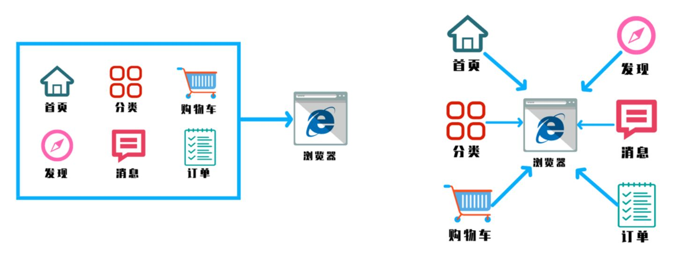
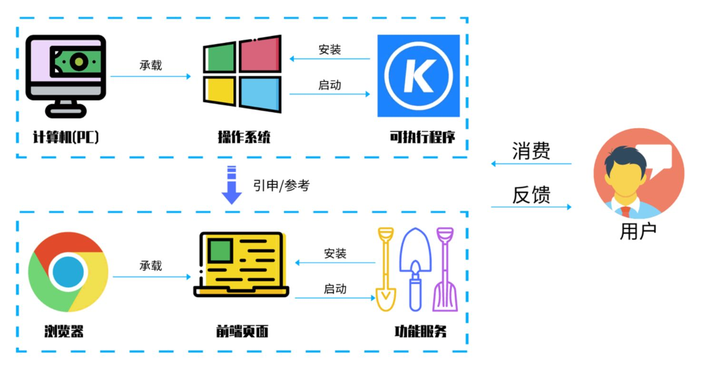
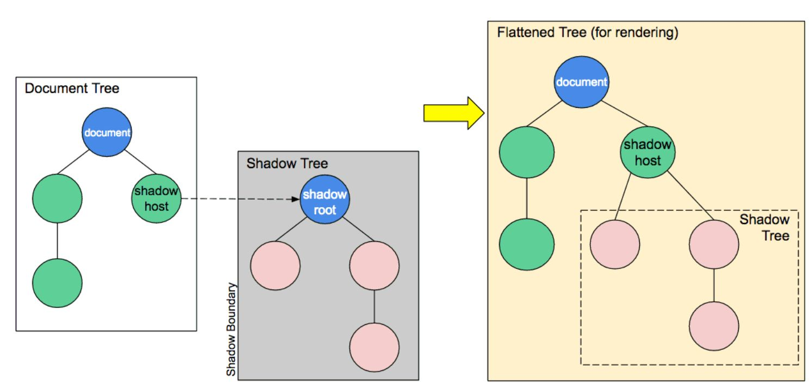
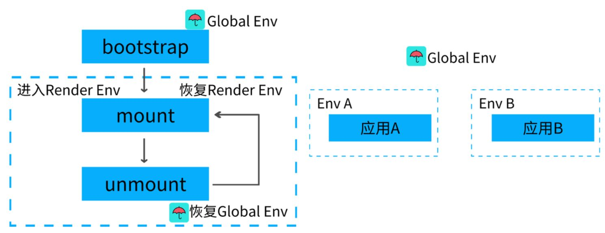
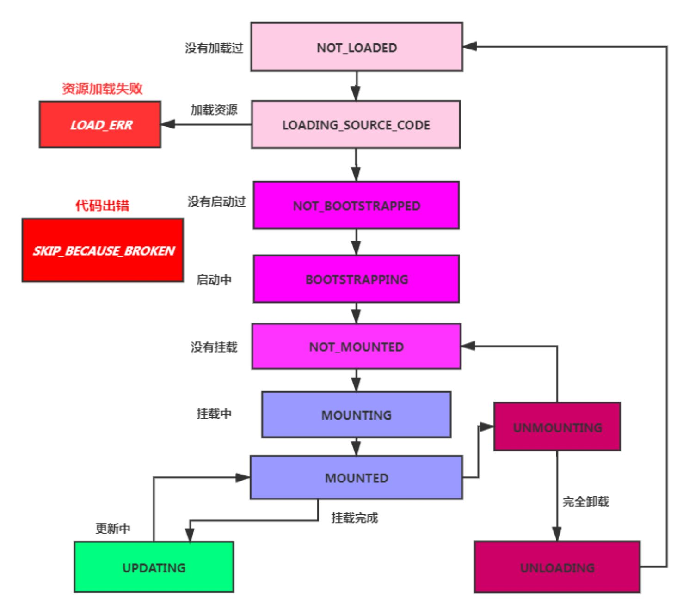
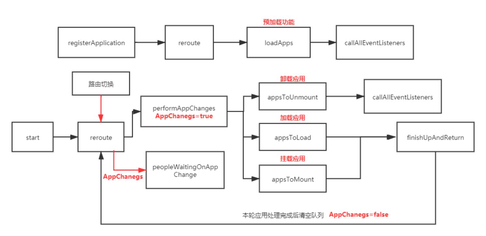

# 微前端 -（实战篇）

最近你有没有经常听到一个词？那就是微前端！ 感觉听上去非常的高大上！然而~

微前端其实非常的简单，容易落地，而且也不高大上~

---

## 1. 为什么需要微前端？

我们通过 `3w` (what,why,how)的方式来讲解微前端

### 1-1 What?什么是微前端？



微前端就是将不同的功能按照不同的维度拆分成多个子应用。通过主应用来加载这些子应用。

微前端的核心在于**拆**，拆完后在**合**！

### 1-2 Why?为什么去使用他？

- 不同团队间开发同一个应用技术栈不同怎么破？
- 希望每个团队都可以独立开发，独立部署怎么破？
- 项目中还需要老的应用代码怎么破？

我们是不是可以将一个应用划分成若干个子应用，将子应用打包成一个个的lib。当路径切换时加载不同的子应用。这样每个子应用都是独立的，技术栈也不用做限制了！从而解决了前端协同开发问题

### 1-3 How?怎样落地微前端？



2018年 Single-SPA诞生了， `single-spa` 是一个用于前端微服务化的 `JavaScript` 前端解决方案 (本身没有处理样式隔离， `js` 执行隔离) 实现了路由劫持和应用加载

2019年 `qiankun` 基于Single-SPA, 提供了更加开箱即用的 `API` （ `single-spa` + `sandbox` + `import-html-entry` ） 做到了，技术栈无关、并且接入简单（像 `iframe` 一样简单）

> 总结：子应用可以独立构建，运行时动态加载,主子应用完全解耦，技术栈无关，靠的是协议接入（子应用必须导出 bootstrap、mount、unmount方法）

这里先回答大家肯定会问的问题：

### 1-4 这不是 `iframe` 吗？

- 如果使用 `iframe` ， `iframe` 中的子应用切换路由时用户刷新页面就尴尬了。

**应用通信:**

- 基于URL来进行数据传递，但是传递消息能力弱
- 基于 `CustomEvent` 实现通信
- 基于props主子应用间通信
- 使用全局变量、 `Redux` 进行通信

**公共依赖:**

- `CDN` - externals
- `webpack` 联邦模块

---

## 2. SingleSpa 实战

### 1).构建子应用

```sh
vue create spa-vue
npm install single-spa-vue
```

```js
import singleSpaVue from 'single-spa-vue';
const appOptions = {
    el: '#vue',
    router,
    render: h => h(App)
}
// 在非子应用中正常挂载应用
if(!window.singleSpaNavigate){
    delete appOptions.el;
    new Vue(appOptions).$mount('#app');
}
const vueLifeCycle = singleSpaVue({
    Vue,
    appOptions
});
// 子应用必须导出 以下生命周期 bootstrap、mount、unmount
export const bootstrap = vueLifeCycle.bootstrap;
export const mount = vueLifeCycle.mount;
export const unmount = vueLifeCycle.unmount;
export default vueLifeCycle;
```

```js
const router = new VueRouter({
    mode: 'history',
    base: '/vue',
    routes
})
```

> 配置子路由基础路径

### 2).配置库打包

```js
module.exports = {
    configureWebpack: {
        output: {
            library: 'singleVue',
            libraryTarget: 'umd'
        },
        devServer:{
            port:10000
        }
    }
}
```

> 将子模块打包成类库

### 3).主应用搭建

```html
<div id="nav">
    <router-link to="/">首页</router-link>
    <router-link to="/vue">vue项目</router-link>
    <div id="vue"></div>
</div>
```

> 将子应用挂载到 `id="vue"` 标签中

```js
import Vue from 'vue'
import App from './App.vue'
import router from './router'
import ElementUI from 'element-ui';
import 'element-ui/lib/theme-chalk/index.css';
Vue.use(ElementUI);

const loadScript = async (url)=> {
    await new Promise((resolve,reject)=>{
        const script = document.createElement('script');
        script.src = url;
        script.onload = resolve;
        script.onerror = reject;
        document.head.appendChild(script)
    });
}

import { registerApplication, start } from 'single-spa';
registerApplication(
    'singleVue',
    async ()=>{
        await loadScript('http://localhost:10000/js/chunk-vendors.js');
        await loadScript('http://localhost:10000/js/app.js');
        return window.singleVue
    },
    location => location.pathname.startsWith('/vue')
)
start();
new Vue({
    router,
    render: h => h(App)
}).$mount('#app')
```

### 4).动态设置子应用 `publicPath`

```js
if(window.singleSpaNavigate){
    __webpack_public_path__ = 'http://localhost:10000/'
}
```

---

## 3. `qiankun` 实战

### 1).主应用编写

```html
<el-menu :router="true" mode="horizontal">
    <el-menu-item index="/">首页</el-menu-item>
    <el-menu-item index="/vue">vue应用</el-menu-item>
    <el-menu-item index="/react">react应用</el-menu-item>
</el-menu>
<router-view v-show="$route.name"></router-view>
<div v-show="!$route.name" id="vue"></div>
<div v-show="!$route.name" id="react"></div>
```

### 2).注册子应用

```js
import {registerMicroApps,start} from 'qiankun'
const apps = [
    {
        name:'vueApp',
        entry:'//localhost:10000',
        container:'#vue',
        activeRule:'/vue'
    },
    {
        name:'reactApp',
        entry:'//localhost:20000',
        container:'#react',
        activeRule:'/react'
    }
]
registerMicroApps(apps);
start();
```

### 3).子Vue应用

```js
let instance = null;
function render(){
    instance = new Vue({
        router,
        render: h => h(App)
    }).$mount('#app')
}
if(window.__POWERED_BY_QIANKUN__){
    __webpack_public_path__ = window.__INJECTED_PUBLIC_PATH_BY_QIANKUN__;
}
if(!window.__POWERED_BY_QIANKUN__){render()}
export async function bootstrap(){}
export async function mount(props){render();}
export async function unmount(){instance.$destroy();}
```

**打包配置**

```js
module.exports = {
    devServer:{
        port:10000,
        headers:{
            'Access-Control-Allow-Origin':'*'
        }
    },
    configureWebpack:{
        output:{
            library:'vueApp',
            libraryTarget:'umd'
        }
    }
}
```

### 4).子React应用

```js
import React from 'react';
import ReactDOM from 'react-dom';
import './index.css';
import App from './App';
function render() {
    ReactDOM.render(
        <React.StrictMode>
            <App />
        </React.StrictMode>,
        document.getElementById('root')
    );
}
if(!window.__POWERED_BY_QIANKUN__){
    render()
}
export async function bootstrap() {}
export async function mount() {render();}
export async function unmount() {
    ReactDOM.unmountComponentAtNode(document.getElementById("root"));
}
```

重写 `react` 中的 `webpack` 配置文件（`config-overrides.js`）

```sh
yarn add react-app-rewired --save-dev
```

```js
module.exports = {
    webpack: (config) => {
        config.output.library = `reactApp`;
        config.output.libraryTarget = "umd";
        config.output.publicPath = 'http://localhost:20000/'
        return config
    },
    devServer: function (configFunction) {
        return function (proxy, allowedHost) {
            const config = configFunction(proxy, allowedHost);
            config.headers = {
                "Access-Control-Allow-Origin": "*",
            };
            return config;
        };
    },
};
```

**配置 .env 文件**

```
PORT=20000
WDS_SOCKET_PORT=20000
```

**React路由配置**

```js
import { BrowserRouter, Route, Link } from "react-router-dom"
const BASE_NAME = window.__POWERED_BY_QIANKUN__ ? "/react" : "";
function App() {
    return (
        <BrowserRouter basename={BASE_NAME}>
            <Link to="/">首页</Link>
            <Link to="/about">关于</Link>
            <Route path="/" exact render={() => <h1>hello home</h1>}></Route>
            <Route path="/about" render={() => <h1>hello about</h1>}></Route>
        </BrowserRouter>
    );
}
```

---

## 4. CSS 隔离方案

子应用之间样式隔离：

- `Dynamic Stylesheet` 动态样式表，当应用切换时移除老应用样式，添加新应用样式

主应用和子应用之间的样式隔离：

- `BEM` (Block Element Modifier) 约定项目前缀
- `CSS-Modules` 打包时生成不冲突的选择器名
- `Shadow DOM` 真正意义上的隔离
- `css-in-js`



```js
let shadowDom = shadow.attachShadow({ mode: 'open' });
let pElement = document.createElement('p');
pElement.innerHTML = 'hello world';
let styleElement = document.createElement('style');
styleElement.textContent = `
    p{color:red}
`
shadowDom.appendChild(pElement);
shadowDom.appendChild(styleElement)
```

> shadow DOM 可以实现真正的隔离机制

---

## 5. JS 沙箱机制



当运行子应用时应该跑在内部沙箱环境中

- 快照沙箱，在应用沙箱挂载或卸载时记录快照，在切换时依据快照恢复环境 (无法支持多实例)
- Proxy 代理沙箱,不影响全局环境

### 1).快照沙箱

- 1.激活时将当前window属性进行快照处理
- 2.失活时用快照中的内容和当前window属性比对
- 3.如果属性发生变化保存到 `modifyPropsMap` 中，并用快照还原window属性
- 4.在次激活时，再次进行快照，并用上次修改的结果还原window

```js
class SnapshotSandbox {
    constructor() {
        this.proxy = window;
        this.modifyPropsMap = {}; // 修改了那些属性
        this.active();
    }
    active() {
        this.windowSnapshot = {}; // window对象的快照
        for (const prop in window) {
            if (window.hasOwnProperty(prop)) {
                // 将window上的属性进行拍照
                this.windowSnapshot[prop] = window[prop];
            }
        }
        Object.keys(this.modifyPropsMap).forEach(p => {
            window[p] = this.modifyPropsMap[p];
        });
    }
    inactive() {
        for (const prop in window) { // diff 差异
            if (window.hasOwnProperty(prop)) {
                // 将上次拍照的结果和本次window属性做对比
                if (window[prop] !== this.windowSnapshot[prop]) {
                    // 保存修改后的结果
                    this.modifyPropsMap[prop] = window[prop];
                    // 还原window
                    window[prop] = this.windowSnapshot[prop];
                }
            }
        }
    }
}
```

```js
let sandbox = new SnapshotSandbox();
((window) => {
    window.a = 1;
    window.b = 2;
    window.c = 3
    console.log(a,b,c)
    sandbox.inactive();
    console.log(a,b,c)
})(sandbox.proxy);
```

> 快照沙箱只能针对单实例应用场景,如果是多个实例同时挂载的情况则无法解决，只能通过proxy代理沙箱来实现

### 2).Proxy 代理沙箱

```js
class ProxySandbox {
    constructor() {
        const rawWindow = window;
        const fakeWindow = {}
        const proxy = new Proxy(fakeWindow, {
            set(target, p, value) {
                target[p] = value;
                return true
            },
            get(target, p) {
                return target[p] || rawWindow[p];
            }
        });
        this.proxy = proxy
    }
}

let sandbox1 = new ProxySandbox();
let sandbox2 = new ProxySandbox();
window.a = 1;
((window) => {
    window.a = 'hello';
    console.log(window.a)
})(sandbox1.proxy);
((window) => {
    window.a = 'world';
    console.log(window.a)
})(sandbox2.proxy);
```

> 每个应用都创建一个proxy来代理window，好处是每个应用都是相对独立，不需要直接更改全局window属性！

---


# 从零实现微前端框架

## 一.初始化开发环境

初始化配置安装rollup

```sh
npm init -y
install rollup rollup-plugin-serve
```

```js
serve from 'rollup-plugin-s
export default {
  output:{
    Wsmue=sornN
    format:"umd",
    name:'singleSpa',
    sourcemap:true
  },
  plugins:[
    serve({
      openPage: / index.html
      contentBase:'
    })
    port:3000
```

这里我们一切从简,只借助rollup 模块化和打包的能力~,不进行过多的rollup 配置,把精力放到编写微前端的核心逻辑上~~~

## 二.SignleSpa 的使用方式

```js
singleSpa.registerApplication('app1',
  async ()=>{
    return {
      bootstrap:async()=>{
        console.log('应用启动');
      },
      mount:async()=>{
        console.log('应用挂载');
      },
      unmount:async()=>{
        console.log('应用卸载')
      }
    }
  },
  location =>location.hash.startsWith('#/app1'),
  {store:{name:'zf'}}
);
singleSpa.start();
```

参数分别是:

- appName :当前注册应用的名字
- loadApp :加载函数(必须返回的是promise),返回的结果必须包含bootstrap 、mount 和unmount 做为接入协议
- activityWhen :满足条件时调用loadApp 方法
- customProps :自定义属性可用于父子应用通信

**根据使用方式编写源码**

```js
const apps =[];

export function registerApplication(appName,loadApp,activeWhen,customProps){
  apps.push({
    name:appName,
    loadApp,
    activeWhen,
    customProps,
  });
}

export function start(){
  //todo...
}

export {registerApplication}from './applications/app.js';
export {start}from './start.js';
```

## 三.应用加载状态-生命周期



```js
export const NOT_LOADED ="NOT_LOADED";//没有加载过
export const LOADING_SOURCE_CODE ="LOADING_SOURCE_CODE";//加载原代
export const NOT_BOOTSTRAPPED ="NOT_BOOTSTRAPPED";//没有启动
export const BOOTSTRAPPING ="BOOTSTRAPPING";//启动中
export const NOT_MOUNTED ="NOT_MOUNTED";//没有挂载
export const MOUNTING ="MOUNTING";//挂载中
export const MOUNTED ="MOUNTED";//挂载完毕
export const UPDATING ="UPDATING";//更新中
export const UNMOUNTING ="UNMOUNTING";//卸载中
export const UNLOADING ="UNLOADING";//没有加载中
export const LOAD_ERROR ="LOAD_ERROR";//加载失败
export const SKIP_BECAUSE_BROKEN ="SKIP_BECAUSE_BROKEN";//运行出错

export function isActive(app){//当前app是否已经挂载
  return app.status ===MOUNTED;
}

export function shouldBeActive(app){//当前app是否应该激活
  return app.activeWhen(window.location);
}
```

**标注应用状态**

```js
import {NOT_LOADED }from './app.helpers';

apps.push({
  name:appName,
  loadApp,
  activeWhen,
  customProps,
  status:NOT_LOADED //默认应用为未加载
});
```

## 4 .加载应用并启动

```js
import {reroute}from '../navigation/reroute.js';

export function registerApplication(appName,loadApp,activeWhen,customProps){
  //...
  reroute();//这个是加载应用
}
```

```js
import {reroute}from './navigation/reroute'
export let started =false;

export function start(){
  started =true;
  reroute();//这个是启动应用
}
```

reroute方法就是比较核心的一个方法啦~,当注册应用时reroute的功能是加载子应用,当调用start方法时是挂载应用。

## 五.reroute方法

这个方法是整个Single-SPA 中最核心的方法,当路由切换时也会执行该逻辑

### 1).获取对应状态的app

```js
import {getAppChanges}from '../applications/apps';

export function reroute(){
  const {
    appsToLoad,//获取要去加载的app
    appsToMount,//获取要被挂载的
    appsToUnmount //获取要被卸载的
  }=getAppChanges();
}
```

```js
export function getAppChanges(){
  const appsToUnmount =[];
  const appsToLoad =[];
  const appsToMount =[];
  apps.forEach(app =>{
    const appShouldBeActive =app.status !==SKIP_BECAUSE_BROKEN
    switch (app.status){//toLoad
      case STATUS.NOT_LOADED:
      case STATUS.LOADING_SOURCE_CODE:
        if(appShouldBeActive){
          appsToLoad.push(app);
        }
        break;
      case STATUS.NOT_BOOTSTRAPPED://toMount
      case STATUS.NOT_MOUNTED:
        if(appShouldBeActive){
          appsToMount.push(app);
        }
        break
      case STATUS.MOUNTED://toUnmount
        if(!appShouldBeActive){
          appsToUnmount.push(app);
        }
    }
  });
  return {appsToUnmount,appsToLoad,appsToMount}
}
```

根据状态筛选对应的应用

### 2".预加载应用

当用户没有调用start 方法时,我们默认会先进行应用的加载

```js
if(started){
  return performAppChanges();
}else{
  return loadApps();
}

async function performAppChanges(){
  //启动逻辑
}

async function loadApps(){
  //预加载应用
}
```

```js
import {toLoadPromise}from '../lifecycles/load';

async function loadApps(){//预加载应用
  await Promise.all(appsToLoad.map(toLoadPromise));
}
```

```js
import {LOADING_SOURCE_CODE,NOT_BOOTSTRAPPED }from "../applications/app.helpers";

function flattenFnArray(fns){//将函数通过then链连接起来
  fns =Array.isArray(fns)?fns :[fns];
  return function(props){
    return fns.reduce((p,fn)=>p.then(()=>fn(props)),Promise.resolve());
  }
}

export async function toLoadPromise(app){
  app.status =LOADING_SOURCE_CODE;
  let {bootstrap,mount,unmount }=await app.loadApp(app.customProps);
  app.status =NOT_BOOTSTRAPPED;
  app.bootstrap =flattenFnArray(bootstrap);
  app.mount =flattenFnArray(mount);
  app.unmount =flattenFnArray(unmount);
  return app;
}
```

用户load函数返回的bootstrap 、mount 、unmount 可能是数组形式,我们将这些函数进行组合

### 3).app 运转逻辑

**路由切换时卸载不需要的应用**

```js
import {toUnmountPromise}from '../lifecycles/unmount';
import {toUnloadPromise}from '../lifecycles/unload';

async function performAppChanges(){
  //卸载不需要的应用,挂载需要的应用
  let unmountPromises =appsToUnmount.map(toUnmountPromise).map(unmountPromise=>unmountPromise.catch(()=>{}));
}
```

> 这里为了更加直观,我就采用最简单的方法来实现,调用钩子,并修改应用状态

```js
import {UNMOUNTING,NOT_MOUNTED ,MOUNTED}from "../applications/app.helpers";

export async function toUnmountPromise(app){
  if(app.status !=MOUNTED){
    return app;
  }
  app.status =UNMOUNTING;
  await app.unmount(app);
  app.status =NOT_MOUNTED;
  return app;
}
```

```js
import {NOT_LOADED,UNLOADING }from "../applications/app.helpers";
const appsToUnload ={};

export async function toUnloadPromise(app){
  if(!appsToUnload[app.name]){
    return app;
  }
  app.status =UNLOADING;
  delete appsToUnload[app.name];
  app.status =NOT_LOADED;
  return app;
}
```

**匹配到没有加载过的应用(加载->启动->挂载)**

```js
const loadThenMountPromises =appsToLoad.map(async (app)=>{
  app =await toLoadPromise(app);
  app =await toBootstrapPromise(app);
  return toMountPromise(app);
});
```

> 这里需要注意一下,可能还有没加载完的应用这里不要进行重复加载

```js
export async function toLoadPromise(app){
  if(app.loadPromise){
    return app.loadPromise;
  }
  if (app.status !==NOT_LOADED){
    return app;
  }
  app.status =LOADING_SOURCE_CODE;
  return (app.loadPromise =Promise.resolve().then(async ()=>{
    let {bootstrap,mount,unmount }=await app.loadApp(app.customProps);
    app.status =NOT_BOOTSTRAPPED;
    app.bootstrap =flattenFnArray(bootstrap);
    app.mount =flattenFnArray(mount);
    app.unmount =flattenFnArray(unmount);
    delete app.loadPromise;
    return app;
  }));
}
```

```js
import {BOOTSTRAPPING,NOT_MOUNTED,NOT_BOOTSTRAPPED }from "../applications/app.helpers";

export async function toBootstrapPromise(app){
  if(app.status !==NOT_BOOTSTRAPPED){
    return app;
  }
  app.status =BOOTSTRAPPING;
  await app.bootstrap(app.customProps);
  app.status =NOT_MOUNTED;
  return app;
}
```

```js
import {MOUNTED,MOUNTING,NOT_MOUNTED }from "../applications/app.helpers";

export async function toMountPromise(app){
  if (app.status !==NOT_MOUNTED){
    return app;
  }
  app.status =MOUNTING;
  await app.mount();
  app.status =MOUNTED;
  return app;
}
```

**已经加载过了的应用(启动->挂载)**

```js
const mountPromises =appsToMount.map(async (app)=>{
  app =await toBootstrapPromise(app);
  return toMountPromise(app);
});
await Promise.all(unmountPromises);//等待先卸载完成
await Promise.all([...loadThenMountPromises,...mountPromises]);
```

## 六.路由劫持

```js
import {reroute }from "./reroute.js";

export const routingEventsListeningTo =["hashchange","popstate"];
const capturedEventListeners ={//存储hashchang和popstate注册的方法
  hashchange:[],
  popstate:[]
}

function urlReroute(){
  reroute([],arguments)
}

//劫持路由变化
window.addEventListener('hashchange',urlReroute);
window.addEventListener('popstate',urlReroute);

//重写addEventListener方法
const originalAddEventListener =window.addEventListener;
const originalRemoveEventListener =window.removeEventListener;

window.addEventListener =function(eventName,fn){
  if (routingEventsListeningTo.indexOf(eventName)>=0&&!capturedEventListeners[eventName].includes(fn)){
    capturedEventListeners[eventName].push(fn);
    return;
  }
  return originalAddEventListener.apply(this,arguments);
}

window.removeEventListener =function(eventName,listenerFn){
  if (routingEventsListeningTo.indexOf(eventName)>=0){
    capturedEventListeners[eventName]=capturedEventListeners[
      eventName
    ].filter((fn)=>fn !==listenerFn);
    return;
  }
  return originalRemoveEventListener.apply(this,arguments);
};

function patchedUpdateState(updateState,methodName){
  return function(){
    const urlBefore =window.location.href;
    const result =updateState.apply(this,arguments);
    const urlAfter =window.location.href;
    if (urlBefore !==urlAfter){
      urlReroute(new PopStateEvent('popstate',{state:window.history.state}));
    }
    return result;
  }
}

//重写pushState 和repalceState方法
window.history.pushState = patchedUpdateState(window.history.pushState,'pushState');
window.history.replaceState = patchedUpdateState(window.history.replaceState,'replaceState');

//在子应用加载完毕后调用此方法,执行拦截的逻辑(保证子应用加载完后执行)
export function callCapturedEventListeners(eventArguments){
  if (eventArguments){
    const eventType = eventArguments[0].type;
    if (routingEventsListeningTo.indexOf(eventType)>=0){
      capturedEventListeners[eventType].forEach((listener)=>{
        listener.apply(this,eventArguments);
      });
    }
  }
}
```

> 为了保证应用加载逻辑最先被处理,我们对路由的一系列的方法进行重写,确保加载应用的逻辑最先被调用,其次手动派发事件

## 七.加载应用

```js
await Promise.all(appsToLoad.map(toLoadPromise));//加载后触发路由方法
callCapturedEventListeners(eventArguments);
await Promise.all(unmountPromises);//等待先卸载完成后触发路由方法
callCapturedEventListeners(eventArguments);
```

校验当前是否需要被激活,在进行启动和挂载

```js
async function tryToBootstrapAndMount(app){
  if (shouldBeActive(app)){
    app =await toBootstrapPromise(app);
    return toMountPromise(app);
  }
  return app;
}
```

# 八.批处理加载等待



```js
export function reroute(pendings =[],eventArguments){
  if (appChangeUnderway){
    return new Promise((resolve,reject)=>{
      peopleWaitingOnAppChange.push({
        resolve,
        reject,
        eventArguments
      })
    });
  }
  //...
  if (started){
    appChangeUnderway =true;
    return performAppChanges();
  }

  async function performAppChanges(){
    //...
    finishUpAndReturn();//完成后批量处理在队列中的任务
  }

  function finishUpAndReturn(){
    appChangeUnderway = false;
    if(peopleWaitingOnAppChange.length > 0){
      const nextPendingPromises = peopleWaitingOnAppChange;
      peopleWaitingOnAppChange = [];
      reroute(nextPendingPromises)
    }
  }
}
```

> 这里的思路和Vue.nextTick 一样,如果当前应用正在加载时,并且用户频繁切换路由。我们会将此时的reroute方法暂存起来,等待当前应用加载完毕后再次触发reroute渲染应用,从而节约性能!

最终别忘了,完成一轮应用加载时,需要手动触发用户注册的路由事件!

```js
callAllEventListeners();

function callAllEventListeners(){
  pendingPromises.forEach((pendingPromise)=>{
    callCapturedEventListeners(pendingPromise.eventArguments);
  });
  callCapturedEventListeners(eventArguments);
}
```****

---

Previous page 微前端概念篇
